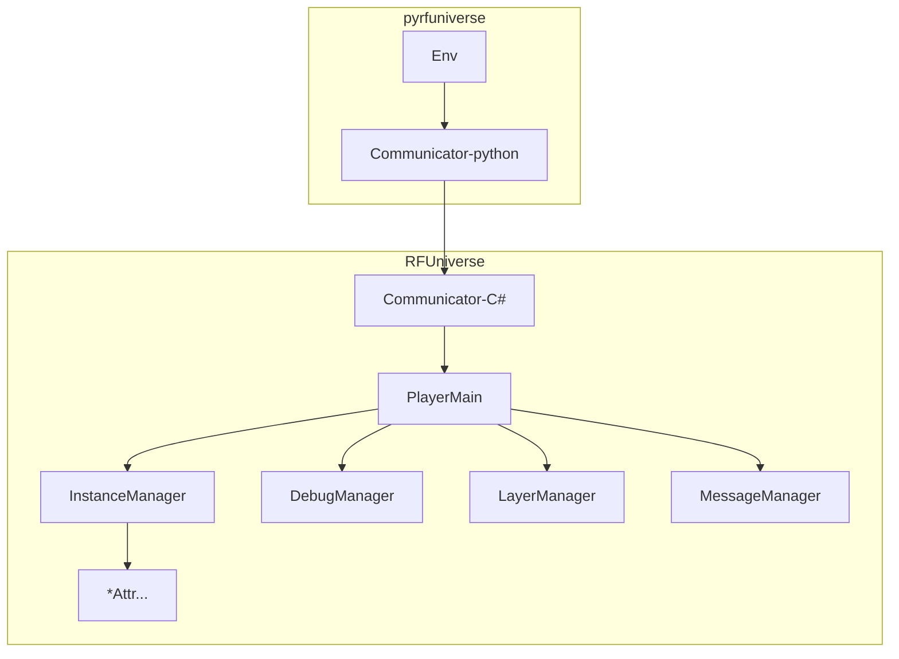
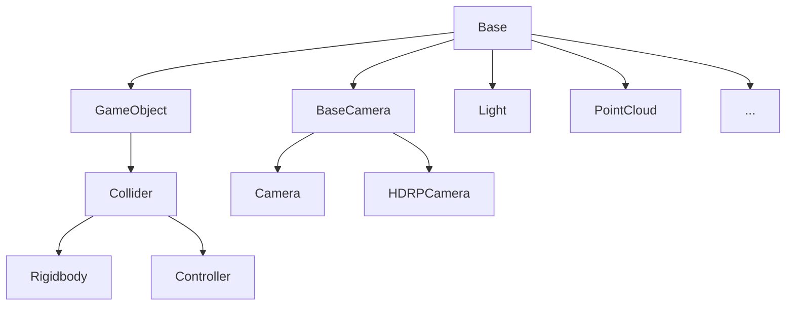

# RFUniverse Developer Guide

Developers can quickly add custom features under the RFUniverse framework according to this document.

This document is intended for developers with some understanding of Unity C# development and Python development.

---

##### Importing RFUniverse SDK

1. Download [RFUniverse Core SDK](https://github.com/mvig-robotflow/rfuniverse/releases)

2. Create and open a new Unity project

3. Drag and drop **RFUniverse_Core_SDK_vx.x.x.unitypackage** into Unity to import the asset package

4. Close the Unity project and restart it

5. Click on the menu `RFUniverse/Check Plugins (Fix Error)` and wait for the console to output `Check Plugins (Fix Error) Done`

6. Click on the menu `RFUniverse/Fix Addressable`

---

##### Clone pyrfuniverse

> :warning: Please replace [0.10.7] in the following commands with the version number of the RFUniverse Core SDK you imported

```bash
git clone https://github.com/mvig-robotflow/pyrfuniverse.git
cd pyrfuniverse
git checkout v0.10.7
```

---

##### Process of building custom simulation scenes in Unity

1. Copy an Empty scene and open it

2. Add objects to the scene and attach the corresponding Attr scripts, manually set different IDs, ensuring there are no duplicates

3. Refer to pyrfuniverse/Test to write Python scripts, use IDs to read information from Attr objects and call interfaces

4. Normally publish the scene, after publishing use it the same way as our official Release

---

##### RFUniverse Code Execution Structure



###### PlayerMain

The main script running the simulation environment, which contains interfaces related to the environment.

###### Manager

InstanceManager: Centrally manages all Attr objects in the scene, distributes structures, and collects data.

DebugManager: Manages Debug related features and interfaces, does not affect simulation execution.

LayerManager: Manages Unity rendering and physics layers.

MessageManager: Features and interfaces related to dynamic messages.

###### Attributes

Attr is the basic unit of objects in RFUniverse, all objects are derived from BaseAttr, such as GameObjectAttr, RigidbodyAttr, ControllerAttr, CameraAttr, etc.



Where:

BaseAttr: Provides basic properties for object loading, creation, deletion, and movement

GameObjectAttr: Extends simple visual effect modifications for objects

ColliderAttr: Extends modification functions for object colliders

RigidbodyAttr: Extends the rigid body properties of objects

ControllerAttr: Extends the operation of robotic arm joints

CameraAttr: Camera image capture function

LightAttr: Lighting control function

PointCloudAttr: Point cloud import and rendering function

---

##### Method to import URDF as ControllerAttr:

1. Import URDF resource files into the Unity project

2. In the Project window, select the `.urdf` file, right-click and choose `Import Robot from Selected URDF file`

3. In the pop-up window, select the import parameters:
   
   Axis Type: Generally, for URDF composed of `.obj` model files, select `Z Axis`, otherwise choose `Y Axis`
   
   Mesh Decomposer: Unity default collision or VHACD algorithm convex decomposition for colliders

4. Select the imported Robot in the scene, click on the menu `RFUniverse/Articulation Helper/Normalize RFUniverse Articulation`

5. In the Inspector's `ControllerAttr` script, set the ID

---

##### Method to import models as rigid bodies (Rigidbody):

1. Import the model file into the project

2. Add the model file to the scene

3. Select the object in the scene, in the Inspector window click AddComponent to add the `RigidbodyAttr` script

4. In the Inspector's `RigidbodyAttr` script, set the ID

---

##### Plugins:

[Obi](https://assetstore.unity.com/publishers/5170): Softbody, Cloth, Fluid, and other physical simulation plugins

[BioIK](https://assetstore.unity.com/packages/tools/animation/bio-ik-67819): Joint IK solving plugin

These two plugins are used in the RFUniverse SDK. Without importing these plugins, their functionality is disabled. After importing the plugins, place them in the Plugins directory, then use the menu `RFUniverse/Check Plugins (Fix Error)` to fix the plugin dependencies and enable plugin functionality.

Other internally verified plugins:

[Kinesis - Physical Muscle Model Based Movement](https://assetstore.unity.com/packages/tools/physics/kinesis-physical-muscle-model-based-movement-206089): Muscle and skeletal system

[Cloth Dynamics](https://assetstore.unity.com/packages/tools/physics/cloth-dynamics-194408): GPU cloth simulation

[SteamVR](https://assetstore.unity.com/packages/tools/integration/steamvr-plugin-32647): VR development plugin

Integration and implementation of plugins are according to the normal Unity development logic and have no relation to RFUniverse.

When custom communication is needed, the following dynamic interface is used.

---

##### Adding Custom C# Features —— Dynamic Message Interface

The dynamic message interface allows custom two-way communication between Python and C#. When the RFUniverse functionality doesn't meet the requirements, developers are recommended to use this set of interfaces instead of modifying the SDK source code to avoid conflicts with future SDK upgrades.

In Unity, you can write your own MonoBehaviour C# script using this dynamic interface without inheriting from BaseAttr.

Advanced developers can freely modify RFU and submit Pull Requests for RFU.

* **Python -> Unity**
  
  C#:
  
  `RFUniverse.PlayerMain.Instance.AddListenerObject(string head, Action<object[]> action);`
  
  Start listening by passing in the message name and message reception function. The input parameter type for the reception function is `object[]`.
  
  Python:
  
  `env.SendObject(self, head: str, *args)`
  
  Send by passing in the message name and any number of data.

* **Unity -> Python**
  
  Python:
  
  `env.AddListenerObject(self, head: str, fun)`
  
  Start listening by passing in the message name and message reception function. The input parameter type for the reception function is `list[object]`.
  
  C#:
  
  `RFUniverse.PlayerMain.Instance.SendObject(string head, params object[] objects);`
  
  Send by passing in the message name and any number of data.

For code writing examples of the dynamic message interface, see:

C#: [RFUniverse/Runtime/Scripts/Attributes/CustomAttr.cs](https://github.com/mvig-robotflow/rfuniverse/blob/main/Assets/RFUniverse/Runtime/Scripts/Attributes/CustomAttr.cs)

Python: [pyrfuniverse/Test/test_custom_message.py](https://github.com/mvig-robotflow/pyrfuniverse/blob/main/Test/test_custom_message.py)

**Supported Data Types**

| Python  | <==> | C#            |
|:-------:|:----:|:-------------:|
| int     | <==> | int           |
| float   | <==> | float         |
| str     | <==> | string        |
| bool    | <==> | bool          |
| list    | <==> | List<>        |
| dict    | <==> | Dictionary<,> |
| tuple   | <==> | Tuple         |
| ndarray | <==> | float[]       |

Since Python is dynamically typed, the objects sent by C# can be directly used on the Python side.

Objects sent by Python, when received on the C# side, are of type object and need to be converted to the actual type before use. Value types (int, float, string, bool) can be cast directly, while reference types must be converted using specified methods, see [CustomAttr.cs](https://github.com/mvig-robotflow/rfuniverse/blob/main/Assets/RFUniverse/Runtime/Scripts/Attributes/CustomAttr.cs) for details.

---

##### Adding Custom C# Features —— Custom Attr Script

Refer to [CustomAttr.cs](https://github.com/mvig-robotflow/rfuniverse/blob/main/Assets/RFUniverse/Runtime/Scripts/Attributes/CustomAttr.cs) to write your own custom Attr script.

1. Create a new script inheriting from any existing Attr, such as BaseAttr:
   
   ```
   public class CustomAttr : BaseAttr
   {
   }
   ```

2. If initialization is required, override the Init method:
   
   ```
   public override void Init()
   {
       base.Init();
       // Your Init
   }
   ```

3. To add or modify permanent data sent to Python, override the AddPermanentData method:
   
   ```
   public override void AddPermanentData(Dictionary<string, object> data)
   {
         //(Optional) If you need, Add base class data.
         base.AddPermanentData(data);
         //Write data
         data["your datassage"] = 123456;
   }
   ```

4. To add one-time data (effective only in the next frame), call at any location as needed:
   
   `CollectData.AddDataNextStep("your datassage", 123456);`

5. To add new interfaces, apply the `[RFUAPI]` attribute to the implementation method:
   
   The available input parameter types for the interface are the same as those for the dynamic message interface:
   
   ```
   [RFUAPI]
   // New implementation function
   void Function(string s)
   {
         
         Debug.Log(s);
   }
   ```

6. Right-click on the written Attr script and select `Generate Python Class`. This will automatically generate a Python interface script for that class in the same directory. Copy that script to the `extend` directory of `pyrfuniverse`. When initializing the Env and passing in that Class, you can achieve the extension of the built-in Attr.
   
   ```
   from extend.custom_attr import CustomAttr
   
   env = RFUniverseBaseEnv(ext_attr=[CustomAttr])
   ```
