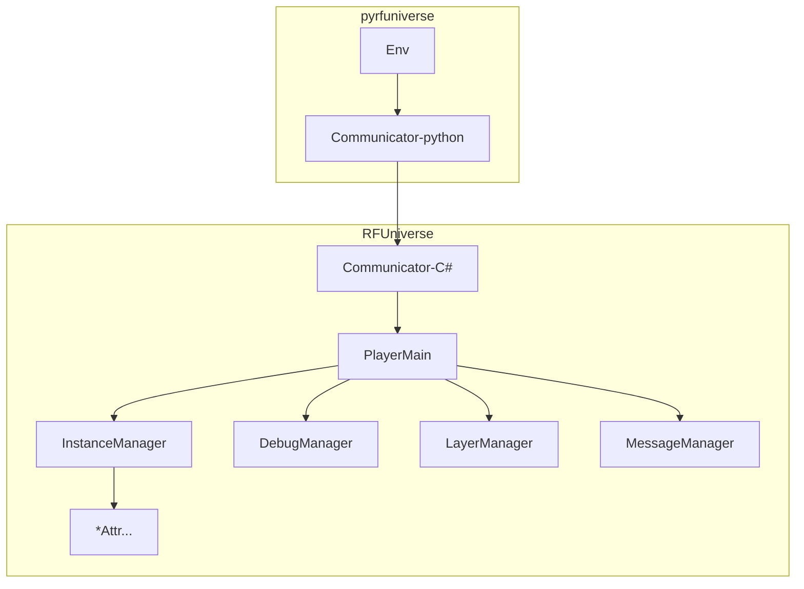
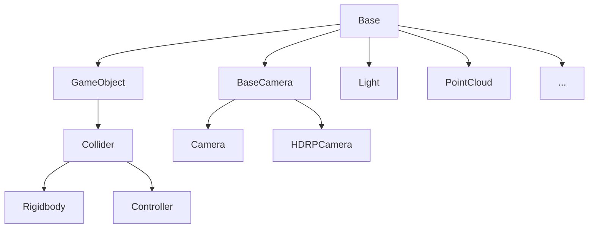

# RFUniverse 开发者指南

开发者可根据该文档，在RFUniverse框架下快速添加自定义功能。

该文档面向对Unity C#开发和python开发有一定了解的开发者。

---

##### RFUniverse SDK 导入

1. 下载[RFUniverse Core SDK](https://github.com/mvig-robotflow/rfuniverse/releases)

2. 新建Unity工程并打开

3. 将 <u>**RFUniverse_Core_SDK_vx.x.x.unitypackage**</u>  拖拽到Unity中，导入该资源包

4. 关闭Unity工程并重新启动

5. 点击菜单`RFUniverse/Check Plugins (Fix Error)`，等待控制台输出`Check Plugins (Fix Error) Done`

6. 点击菜单`RFUniverse/Fix Addressable`

---

##### Clone pyrfuniverse

> :warning:请将以下命令中的[0.10.7]替换为你所导入的RFUniverse Core SDK版本号

```bash
git clone https://github.com/mvig-robotflow/pyrfuniverse.git
cd pyrfuniverse
git checkout v0.10.7
```

---

##### 在Unity中搭建自定义仿真场景流程

1. 复制一份Empty场景并打开

2. 为场景添加物体，并挂载对应的Attr脚本，手动设置不同的ID，保证ID没有重复

3. 参照pyrfuniverse/Test编写python脚本，通过ID读取Attr物体上的信息并调用接口

4. 正常发布该场景，发布后使用方式与我们的官方Release相同

---

##### RFUniverse代码运行结构



###### PlayerMain

仿真环境运行的主脚本，包含与环境相关的接口

###### Manager

InstanceManager：集中管理场景中所有的Attr物体，分发结构，收集数据

DebugManager：管理Debug相关功能和接口，不影响仿真执行

LayerManager：管理Unity渲染和物理层

MessageManager：动态消息相关功能和接口

###### Attributes

Attr是RFUniverse中物体的基本单元，所有的物体都是基于BaseAttr派生而来，如GameObjectAttr，RigidbodyAttr，ControllerAttr， CmaeraAttr等



其中：

BaseAttr：提供了基础的物体加载创建删除移动等属性

GameObjectAttr：扩展物体简单的视觉效果修改

ColldierAttr：扩展物体碰撞体的修改功能

RigidbodyAttr：扩展物体的刚体属性

ControllerAttr：扩展机械臂关节体的操作

CameraAttr：相机图像抓取功能

LightAttr：灯光控制功能

PointCloudAttr：点云导入及渲染功能

---

##### URDF导入为ControllerAttr的方法：

1. 将URDF资源文件导入Unity工程

2. 在Project窗口中选择`.urdf`文件，右键选择`Import Robot form Selected URDF file`

3. 在弹出窗口中选择导入参数：
   
   Axis Type：一般由`.obj`模型文件组成的URDF，选择`Z Axis`，其他情况选择`Y Axis`
   
   Mesh Decomposer：Unity默认碰撞或VHACD算法凸分解碰撞

4. 选择场景中导入的Robot，点击菜单`RFUniverse/Articulation Helper/Normalize RFUniverse Articulaiton`

5. 在Inspector的`ControllerAttr`脚本中设置ID

---

##### 普通模型导入为刚体Rigidbody的方法：

1. 将模型文件导入工程

2. 将模型文件添加进场景

3. 选择场景中的物体，在Inspector窗口中点击AddComponent添加`RigidbodyAttr`脚本

4. 在Inspector的`RigidbodyAttr`脚本中设置ID

---

##### 插件Plugin：

[Obi](https://assetstore.unity.com/publishers/5170)：Softbody，Cloth，Fluid等物理仿真插件

[BioIK](https://assetstore.unity.com/packages/tools/animation/bio-ik-67819)：关节IK解算插件

这两个插件是RFUniverse SDK用到的，在没有导入该插件的情况下，功能是关闭的，导入插件后，将插件放入Plugins目录，随后使用菜单`RFUniverse/Check Plugins (Fix Error)`修复该插件的依赖，以开启插件功能。

其他经过内部验证的插件：

[Kinesis - Physical Muscle Model Based Movement](https://assetstore.unity.com/packages/tools/physics/kinesis-physical-muscle-model-based-movement-206089)：肌肉骨骼系统

[Cloth Dynamics](https://assetstore.unity.com/packages/tools/physics/cloth-dynamics-194408)：GPU布料仿真

[SteamVR](https://assetstore.unity.com/packages/tools/integration/steamvr-plugin-32647)：VR开发插件

插件的集成和功能实现按照正常Unity的开发逻辑进行，与RFUniverse没有关系

当需要进行自定义通信时，则使用下面的动态接口

---

##### 自定义C#功能添加——动态消息接口

动态消息接口，是可以自定义python与c#双向通信的接口， 当RFUniverse功能不满足需求时，推荐开发者使用这一组接口而不是修改SDK源代码，以保证后续SDK升级不会冲突。

Unity中可以自行编写继承MonoBehaviour的C#脚本使用该动态接口，无需继承BaseAttr。

如果是高级开发者则可以随意魔改RFU，并为RFU提交Pull Requests。

* **Python->Unity**
  
  C#:
  
  `RFUniverse.PlayerMain.Instance.AddListenerObject(string head, Action<object[]> action);`
  
  传入消息名称和消息接收函数开启监听，接受函数的传入参数类型为 `object[]`
  
  Python:
  
  `env.SendObject(self, head: str, *args)`
  
  传入消息名称和任意数量的数据进行发送

* **Unity->Python**
  
  Python:
  
  `env.AddListenerObject(self, head: str, fun)`
  
  传入消息名称和消息接收函数开启监听，接受函数的传入参数类型为 `list[object]`
  
  C#:
  
  `RFUniverse.PlayerMain.Instance.SendObject(string head, params object[] objects);`
  
  传入消息名称和任意数量的数据进行发送

动态消息接口的代码编写示例请看：

C#: [RFUniverse/Runtime/Scripts/Attributes/CustomAttr.cs](https://github.com/mvig-robotflow/rfuniverse/blob/main/Assets/RFUniverse/Runtime/Scripts/Attributes/CustomAttr.cs)

python: [pyrfuniverse/Test/test_custom_message.py](https://github.com/mvig-robotflow/pyrfuniverse/blob/main/Test/test_custom_message.py)

**支持的数据类型**

| Python  | <==> | C#            |
|:-------:|:----:|:-------------:|
| int     | <==> | int           |
| float   | <==> | float         |
| str     | <==> | string        |
| bool    | <==> | bool          |
| list    | <==> | List<>        |
| dict    | <==> | Dictionary<,> |
| tuple   | <==> | Tuple         |
| ndarray | <==> | float[]       |

因为python是动态类型，因此C#发送的对象，到python侧后可以直接使用

python发送的对象，C#侧接收后为object类型，需要自行转换为实际类型后使用，其中值类型（int，float， string，bool）可以强制转换，引用类型必需要使用指定方法转换，详见[CustomAttr.cs](https://github.com/mvig-robotflow/rfuniverse/blob/main/Assets/RFUniverse/Runtime/Scripts/Attributes/CustomAttr.cs) 

---

##### 自定义C#功能添加——自定义Attr脚本

参照[CustomAttr.cs](https://github.com/mvig-robotflow/rfuniverse/blob/main/Assets/RFUniverse/Runtime/Scripts/Attributes/CustomAttr.cs)来编写自定义的Attr脚本

1. 根据所需功能新建继承自任意现有Attr的脚本，如BaseAttr
   
   ```
   public class CustomAttr : BaseAttr
   {
   }
   ```

2. 如需初始化操作，请重写Init方法：
   
   ```
   public override void Init()
   {
       base.Init();
       #Your Init
   }
   ```

3. 如需新增或修改发送至python的常驻数据，请重写AddPermanentData方法：
   
   ```
   public override void AddPermanentData(Dictionary<string, object> data)
   {
       //(Optional) If you need, Add base class data.
       base.AddPermanentData(data);
       //Write data
       data["your data"] = 123456;
   }
   ```

4. 如需添加一次性数据（只在下一帧生效），可根据需要在任意位置调用：
   
   `CollectData.AddDataNextStep("your datassage", 123456);`

5. 添加新接口，添加新方法，并为其添加特性标签`[RFUAPI]`
   
   接口可用的输入参数类型与上面的动态消息接口相同：
   
   ```
   [RFUAPI]
   //new implementation function
   voi Function(string s)
   {
       #Do Something
       Debug.Log(s);
   }
   ```

6. 在编写好的Attr脚本上右键：`Generate Python Class`，将在同目录下自动生成该类的python接口脚本，将该脚本Copy到`pyrfuniverse`的`extend`目录，在初始化Env时传入该Class，即可实现对内置Attr的扩展。
   
   ```
   from extend.custom_attr import CustomAttr
   
   env = RFUniverseBaseEnv(ext_attr=[CustomAttr])
   ```
