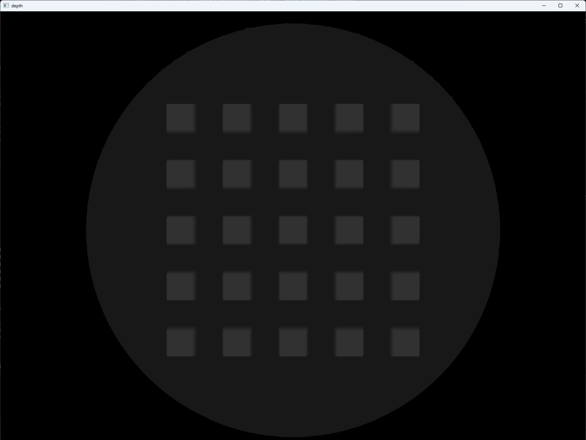

# pyrfuniverse tutorial : test_gelslim

## 1 基本功能

- 展示 GelSlim 触觉传感器仿真



## 2 实现流程

### 2.1 初始化环境

```python
env = RFUniverseBaseEnv(ext_attr=[GelSlimAttr])
```

### 2.2 展示 GelSlim 触觉传感器仿真

```python
gelslim = env.InstanceObject(name="GelSlim", attr_type=GelSlimAttr)
gelslim.SetTransform(position=[0, 0, 0])
target = env.InstanceObject(name="GelSlimTarget", attr_type=attr.RigidbodyAttr)
target.SetTransform(position=[0, 0.03, 0],rotation=[90, 0, 0])
env.SetViewTransform(position=[-0.1, 0.03, 0.], rotation=[0, 90, 0])
```

- `InstanceObject` 实例化 GelSlim 传感器
- `SetTransform` 设定传感器和物体于合适的位置和姿态
- `SetViewTransform` 设定视角于合适的位置和姿态

```python
for i in range(50):
    env.step()
    target.AddForce([0, -1, 0])
```

- `AddForce` 对刚体施加给定的力

```python
gelslim.GetData()
env.step()
image = np.frombuffer(gelslim.data["light"], dtype=np.uint8)
image = cv2.imdecode(image, cv2.IMREAD_COLOR)
cv2.imshow("light", image)
cv2.waitKey(0)
image = np.frombuffer(gelslim.data["depth"], dtype=np.uint8)
image = cv2.imdecode(image, cv2.IMREAD_GRAYSCALE)
cv2.imshow("depth", image)
cv2.waitKey(0)
```

- 对 GelSlim 传感器对象调用 `GetData` 以获取传感器的数据，再用 cv2 模块来展示

```python
gelslim.BlurGel()
gelslim.GetData()
env.step()
image = np.frombuffer(gelslim.data["light"], dtype=np.uint8)
image = cv2.imdecode(image, cv2.IMREAD_COLOR)
cv2.imshow("light", image)
cv2.waitKey(0)
image = np.frombuffer(gelslim.data["depth"], dtype=np.uint8)
image = cv2.imdecode(image, cv2.IMREAD_GRAYSCALE)
cv2.imshow("depth", image)
cv2.waitKey(0)
env.Pend()
env.close()
```

- 对 GelSlim 传感器对象调用 `BlurGel` 可以模糊凝胶网格，来模拟平滑变形。


