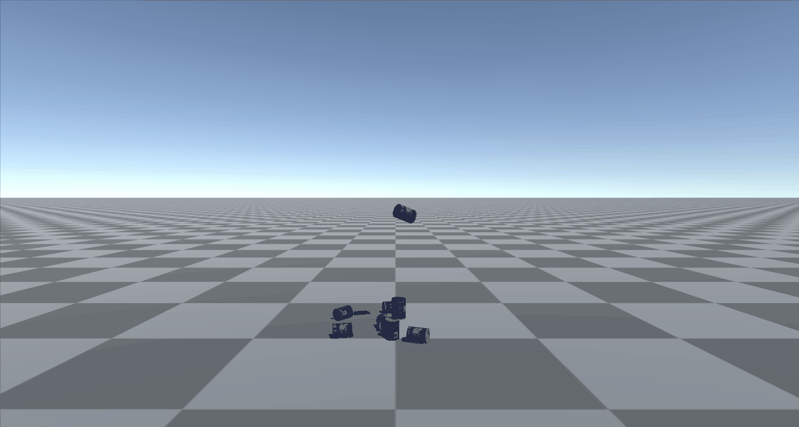

# pyrfuniverse tutorial : test_load_mesh

## 1 基本功能

- obj模型文件导入为刚体
- 效果：导入obj模型文件并复制100个刚体，同时模拟刚体自由落下


## 2 实现流程

### 2.1 初始化环境

```python
import random
import os
from pyrfuniverse.envs.base_env import RFUniverseBaseEnv

env = RFUniverseBaseEnv()
env.step()
```

- `env.step()` 让环境运行一个 $\delta t$ 的时间，这里的 $\delta t$ 就是一个“时间片”的概念。

### 2.2 加载刚体并设定动作

```python
mesh = env.LoadMesh(id=639787, path=os.path.abspath('../Mesh/002_master_chef_can/google_16k/textured.obj'))
mesh.SetTransform(position=[0, 1, 0], rotation=[random.random() * 360, random.random() * 360, random.random() * 360])
```

- `id=639787` ：场景中每一个物体都需要一个唯一 id
- `LoadMesh` 将 `.obj` 文件对应的刚体加载
- `SetTransform` 设定动作，在本测试文件中为在 $[0,1,0]$ 位置的自由落体

### 2.3 重复模拟刚体落下

```python
for i in range(100):
    env.step(20)
    new_mesh = mesh.Copy(new_id=mesh.id + i + 1)
    new_mesh.SetTransform(position=[0, 1, 0], rotation=[random.random() * 360, random.random() * 360, random.random() * 360])

while 1:
    env.step()
```

- 等待20个时间片 `env.step(20)` 完成物体运动并使其稳定
- 复制刚体并重复动作
