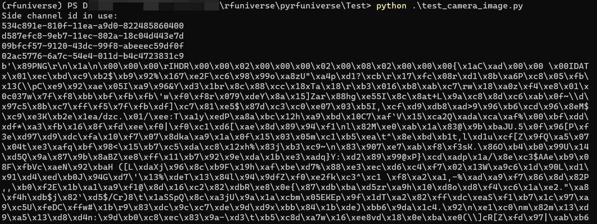

# pyrfuniverse tutorial : test_camera_image

## 1 基本功能

相机截图示例

- 实现效果
  - 指定相机位置与角度
  - 将图片以 PNG 字节流输出并显示

## 2 实现流程

```python
from pyrfuniverse.envs.base_env import RFUniverseBaseEnv
import pyrfuniverse.attributes as attr
import cv2
import numpy as np

env = RFUniverseBaseEnv()

camera = env.InstanceObject(name='Camera', id=123456, attr_type=attr.CameraAttr)
camera.SetTransform(position=[0, 0.25, 0], rotation=[30, 0, 0])
camera.GetDepth(width=512, height=512, zero_dis=1, one_dis=5)
camera.GetDepthEXR(width=512, height=512)
camera.GetRGB(width=512, height=512)
env.step()
```

- 设置相机的初始位置与角度
- `GetDepth` 返回 unit8 的 png，精度较低，因此需要传入一个范围，`zreo_dis` 为 lower bound，`one_dis` 为 upper bound，在这个范围内的 depth 会被量化为 unit8
- `GetDepthEXR` 输出格式为 exr 图片，此种格式支持 32 位 float32，因此不需要`GetDepth` 中的限制

```python
print(camera.data['rgb'])
print(camera.data['depth'])
print(camera.data['depth_exr'])
image_np = np.frombuffer(camera.data['rgb'], dtype=np.uint8)
image_np = cv2.imdecode(image_np, cv2.IMREAD_COLOR)
print(image_np.shape)
env.close()
cv2.imshow("rgb", image_np)
cv2.waitKey(0)
```



- 输出图片字节
- 利用 rgb 对图片进行解码并展示