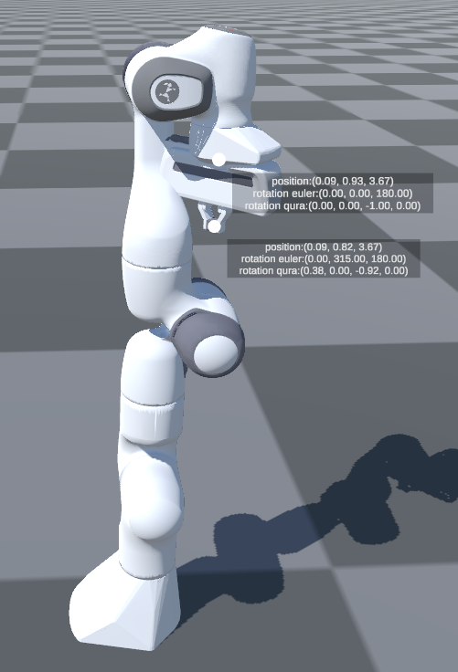
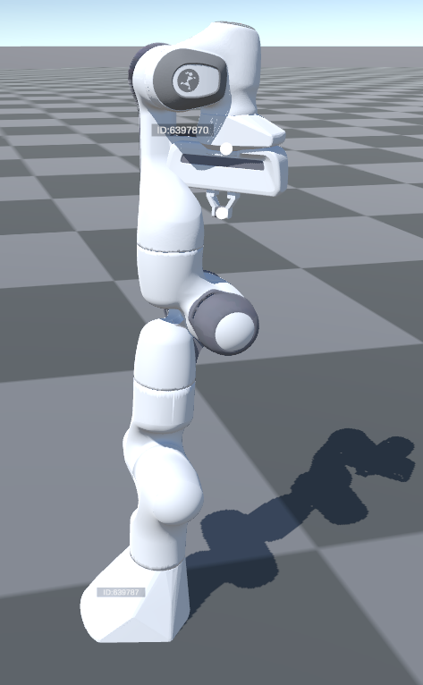
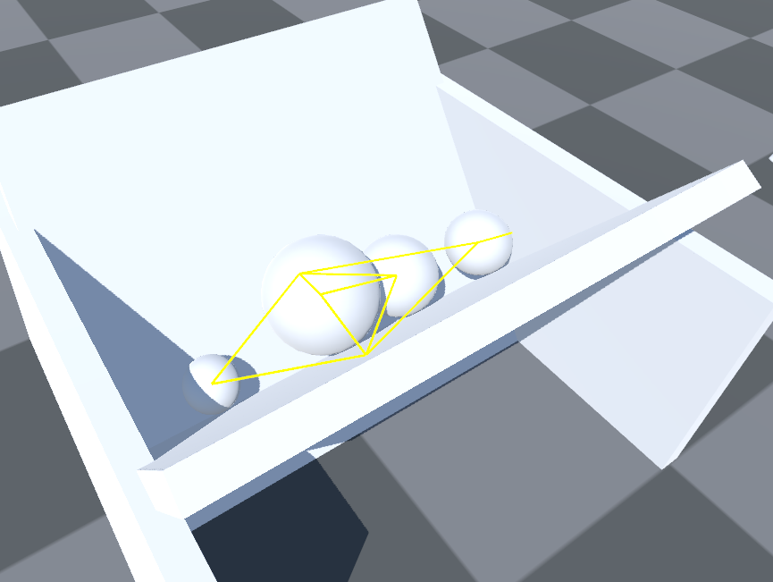

# pyrfuniverse tutorial : test_debug

## 1 基本功能

- 循环展示各个 debug 模块的功能

## 2 实现流程

### 2.1 初始化环境

```python
env = RFUniverseBaseEnv(scene_file="DebugScene.json")
```

- 从预先配置好的 `DebugScene.json` 文件中导入场景

### 2.2 Debug 功能展示

- 以下所用到的 debug 函数都可以传入一个名为 `enable` 的布尔变量来控制对应调试功能的开关

#### 2.2.1 DebugGraspPoint



```python
env.DebugGraspPoint()
env.SendLog("DebugGraspPoint")
env.step(300)
env.DebugGraspPoint(False)
```

- `DebugGraspPoint` 可以显示或隐藏机械臂末端执行器的位置和姿态信息

#### 2.2.2 DebugObjectID



```python
env.DebugObjectID()
env.SendLog("DebugObjectID")
env.step(300)
env.DebugObjectID(False)
```

- `DebugObjectID` 可以显示或隐藏所有物体的 ID 信息

#### 2.2.3 DebugObjectPose


```python
env.DebugObjectPose()
env.SendLog("DebugObjectPose")
env.step(300)
env.DebugObjectPose(False)
```

- `DebugObjectPose` 可以显示或隐藏所有物体的基点（base point）坐标、姿态、缩放信息

#### 2.2.4 DebugColliderBound


```python
env.DebugColliderBound()
env.SendLog("DebugColliderBound")
env.step(300)
env.DebugColliderBound(False)
```

- `DebugColliderBound` 可以显示或隐藏所有物体的碰撞箱

#### 2.2.5 DebugCollisionPair



```python
env.DebugCollisionPair()
env.SendLog("DebugCollisionPair")
env.step(300)
env.DebugCollisionPair(False)
```

- `DebugCollisionPair` 可以显示或隐藏所有的物体碰撞对

#### 2.2.6 Debug3DBBox


```python
env.Debug3DBBox()
env.SendLog("Debug3DBBox")
env.step(300)
env.Debug3DBBox(False)
```

- `Debug3DBBox` 可以显示或隐藏所有物体的 3D 碰撞箱

#### 2.2.7 Debug2DBBox


```python
env.Debug2DBBox()
env.SendLog("Debug2DBBox")
env.step(300000)
env.Debug2DBBox(False)
```

- `Debug2DBBox` 可以显示或隐藏所有物体的 2D 碰撞箱

#### 2.2.8 DebugJointLink


```python
env.DebugJointLink()
env.SendLog("DebugJointLink")
env.step(300)
env.DebugJointLink(False)
```

- `DebugJointLink` 可以显示或隐藏所有的关节信息
