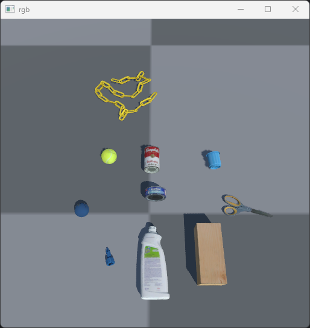
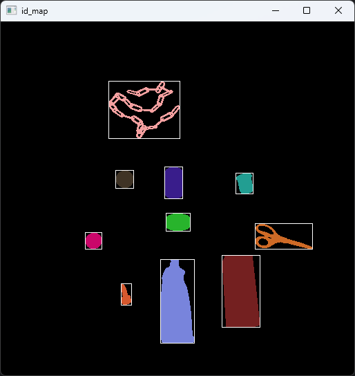
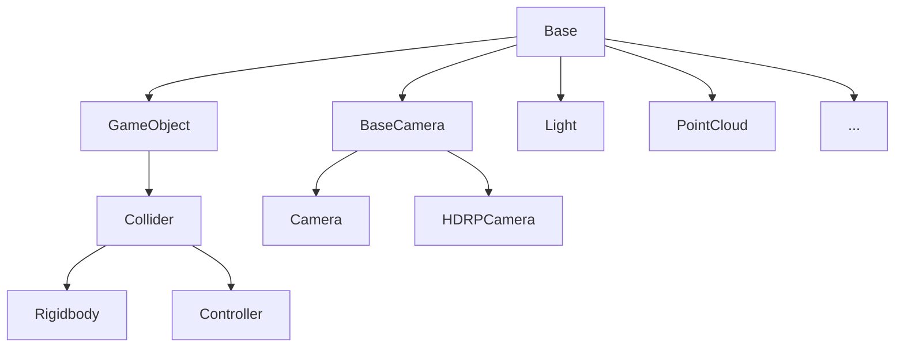

# RFUniverse


[](https://pypi.org/project/pyrfuniverse/)

English|[中文](./README_zh.md)

[Documentation](https://mvig-robotflow.github.io/pyrfuniverse/)

---

RFUniverse is a platform developed in Unity for robot simulation and reinforcement learning, consisting of three main functional modules:

[Python API](https://mvig-robotflow.github.io/pyrfuniverse/pyrfuniverse.envs.html)：Python communication interface 

Unity Player：Receiving messages from Python and executing simulations

Unity EditMode：Used for building or editing simulation scenes. This code is located in a [submodule](https://github.com/mvig-robotflow/rfuniverse_editmode)

---

Follow the steps below to configure and run the sample scene through the published version:

1. Download the [RFUniverse Releases](https://github.com/mvig-robotflow/rfuniverse/releases) and unzip it:
   
   Run the program once, enter the scene and then close it:
   
   Linux：`RFUniverse_For_Linux/RFUniverse.x86_64`
   
   Windows：`RFUniverse_For_Windows/RFUniverse.exe`

2. Create a conda environment and activate it, install the 'pyrfuniverse' package with the **<mark>same version number</mark>** as the RFUniverse Release:
   
   > :warning:Please replace [0.8.3] in the following command with the version number of the RFUniverse Releases you downloaded.
   
   ```bash
   conda create -n rfuniverse python=3.9 -y
   conda activate rfuniverse
   pip install pyrfuniverse==0.8.3
   ```

3. Clone the pyrfuniverse, switch to the Tag with the **<mark>same version number</mark>** as the RFUniverse Release:
   
   > :warning:Please replace [0.8.3] in the following command with the version number of the RFUniverse Releases you downloaded.
   
   ```bash
   git clone https://github.com/mvig-robotflow/pyrfuniverse.git
   cd pyrfuniverse
   git checkout v0.8.3
   ```

4. Run any Python script under 'pyrfuniverse/Test' (some scripts may require installation of large packages such as 'pybullet', 'open3d', etc.):
   
   ```bash
   cd Test
   python test_pick_and_place.py
   ```

---

Additional operations that may be required on Linux systems: 

If an error occurs during runtime, please check this [document](https://github.com/mvig-robotflow/rfuniverse/issues/3) to supplement dependencies

---

##### Test Directory

| Script Name                                                                                                                                       | Function Introduction                                                                                     | Preview                                                                                                                                                                                                                                                                                                                                                                                           |
| ------------------------------------------------------------------------------------------------------------------------------------------------- | --------------------------------------------------------------------------------------------------------- | ------------------------------------------------------------------------------------------------------------------------------------------------------------------------------------------------------------------------------------------------------------------------------------------------------------------------------------------------------------------------------------------------- |
| [test_active_depth](https://github.com/mvig-robotflow/pyrfuniverse/blob/main/Test/test_active_depth.py)                                           | Infrared Depth                                                                                            |  |
| [test_articulation_ik](https://github.com/mvig-robotflow/pyrfuniverse/blob/main/Test/test_articulation_ik.py)                                     | Native IK                                                                                                 |                                                                                                                                                                                                                                                                                                                                               |
| [test_camera_image](https://github.com/mvig-robotflow/pyrfuniverse/blob/main/Test/test_camera_image.py)                                           | Camera Screenshot Example                                                                                 |                                                                                                                                                                                                                                                                                                                                                                                                   |
| [test_custom_message](https://github.com/mvig-robotflow/pyrfuniverse/blob/main/Test/test_custom_message.py)                                       | Custom Messages and Dynamic Messages                                                                      |                                                                                                                                                                                                                                                                                                                                                                                                   |
| [test_debug](https://github.com/mvig-robotflow/pyrfuniverse/blob/main/Test/test_debug.py)                                                         | Loop Display of Various Debug Modules                                                                     |                                                                                                                        |
| [test_digit](https://github.com/mvig-robotflow/pyrfuniverse/blob/main/Test/test_digit.py)                                                         | Interactive Digit Sensor Simulation                                                                       |                                                                                                                                                                                                                                                                                                                                                         |
| [test_grasp_pose](https://github.com/mvig-robotflow/pyrfuniverse/blob/main/Test/test_grasp_pose.py)                                               | Franka Grasp Point Preview                                                                                |                                                                                                                                                                                                                                                                                                                                                                                                   |
| [test_grasp_sim](https://github.com/mvig-robotflow/pyrfuniverse/blob/main/Test/test_grasp_sim.py)                                                 | Franka Grasping Test                                                                                      |                                                                                                                                                                                                                                                                                                                                                     |
| [test_heat_map](https://github.com/mvig-robotflow/pyrfuniverse/blob/main/Test/test_heat_map.py)                                                   | Interactive Heatmap                                                                                       |                                                                                                                                                                                                                                                                                                                                                                                                   |
| [test_humanbody_ik](https://github.com/mvig-robotflow/pyrfuniverse/blob/main/Test/test_humanbody_ik.py)                                           | Human Body IK Interface                                                                                   |                                                                                                                                                                                                                                                                                                                                                                                                   |
| [test_label](https://github.com/mvig-robotflow/pyrfuniverse/blob/main/Test/test_label.py)                                                         | Scene Labeling 2DBBOX                                                                                     |                                                                                                                                                                                                                                                                                                        |
| [test_ligth](https://github.com/mvig-robotflow/pyrfuniverse/blob/main/Test/test_light.py)                                                         | Lighting Parameter Settings                                                                               |                                                                                                                                                                                                                                                                                                                                                                                                   |
| [test_load_mesh](https://github.com/mvig-robotflow/pyrfuniverse/blob/main/Test/test_load_mesh.py)                                                 | Importing OBJ Model as Rigid Body                                                                         |                                                                                                                                                                                                                                                                                                                                                                                                   |
| [test_load_urdf](https://github.com/mvig-robotflow/pyrfuniverse/blob/main/Test/test_load_urdf.py)                                                 | Importing URDF File                                                                                       |                                                                                                                                                                                                                                                                                                                                                                                                   |
| [test_object_data](https://github.com/mvig-robotflow/pyrfuniverse/blob/main/Test/test_object_data.py)                                             | Object Basic Data                                                                                         |                                                                                                                                                                                                                                                                                                                                                                                                   |
| [test_pick_and_place](https://github.com/mvig-robotflow/pyrfuniverse/blob/main/Test/test_pick_and_place.py)                                       | Basic Interface and Grasping Driven by Native IK                                                          |                                                                                                                                                                                                                                                                                                                                                    |
| [test_point_cloud](https://github.com/mvig-robotflow/pyrfuniverse/blob/main/Test/test_point_cloud.py)                                             | Obtaining Depth Image and Converting to Point Cloud Using Image Width, Height, and FOV                    |                                                                                                                                                                                                                                                                                                                                                                                                   |
| [test_point_cloud_render](https://github.com/mvig-robotflow/pyrfuniverse/blob/main/Test/test_point_cloud_render.py)                               | Importing and Displaying .PLY Point Cloud File                                                            |                                                                                                                                                                                                                                                                                                                                                                                                   |
| [test_point_cloud_with_intrinsic_matrix](https://github.com/mvig-robotflow/pyrfuniverse/blob/main/Test/test_point_cloud_with_intrinsic_matrix.py) | Obtaining Depth Image and Converting to Point Cloud Using Camera Intrinsic Matrix                         |                                                                                                                                                                                                                                                                                                                                                                                                   |
| [test_save_gripper](https://github.com/mvig-robotflow/pyrfuniverse/blob/main/Test/test_save_gripper.py)                                           | Saving Gripper as OBJ Model                                                                               |                                                                                                                                                                                                                                                                                                                                                                                                   |
| [test_save_obj](https://github.com/mvig-robotflow/pyrfuniverse/blob/main/Test/test_save_obj.py)                                                   | Saving Multiple Objects in the Scene as OBJ Models                                                        |                                                                                                                                                                                                                                                                                                                                                                                                   |
| [test_scene](https://github.com/mvig-robotflow/pyrfuniverse/blob/main/Test/test_scene.py)                                                         | Scene Building/Saving/Loading                                                                             |                                                                                                                                                                                                                                                                                                                                                                                                   |
| [test_tobor_move](https://github.com/mvig-robotflow/pyrfuniverse/blob/main/Test/test_tobor_move.py)                                               | Tobor Wheel Drive Movement                                                                                |                                                                                                                                                                                                                                                                                                                                                                                                   |
| [test_urdf_parameter](https://github.com/mvig-robotflow/pyrfuniverse/blob/main/Test/test_urdf_parameter.py)                                       | Joint Target Position Setting Panel                                                                       |                                                                                                                                                                                                                                                                                                                                                |
| [test_ompl](https://github.com/mvig-robotflow/pyrfuniverse/blob/main/Test/test_ompl.py)                                                           | Robotic Arm Obstacle Avoidance Planning<br/>**This example requires Linux and self-installation of OMPL** |                                                                                                                                                                                                                                                                                                                                                          |

---

## Enter Edit mode

Launch RFUniverse with the <-edit> parameter to enter Edit mode:

Linux:

```
RFUniverse.x86_64 -edit
```

Windows:

```
RFUniverse.exe -edit
```

---

## Instructions for using Unity source project and SDK

*The following steps assume that you have a basic understanding of Unity Editor*

If you want to add your own custom resources or functions to RFUniverse, you can do so by adding them to the RFUniverse open source project.

If you want to add RFUniverse functionality to your own project, you can import the [RFUniverse Core SDK](https://github.com/mvig-robotflow/rfuniverse/releases)

**If you encounter missing plugin errors in your project, you can restart the project and use the menu RFUniverse/CheckPlugins and RFUniverse/Fix Addressable to fix them.**

---

### Supplementing missing plugins and resources

After opening the RFUniverse project or importing the RFUniverse Core SDK, you need to supplement third-party plugins and resources yourself to enable their functionality:

- [Obi](https://assetstore.unity.com/publishers/5170)：Physical simulation plugins for soft bodies, cloth, fluids, etc.
- [BioIK](https://assetstore.unity.com/packages/tools/animation/bio-ik-67819)：Joint IK solving plugins
- YCB Dataset and IGibson Scene：Please download and import the project from [here](https://github.com/mvig-robotflow/rfuniverse/releases/tag/Dataset)

**Please put the plugins in the Plugins directory, import the plugins, and use the menu RFUniverse/CheckPlugins to fix dependencies**

---

### Assets directory structure

* AddressableAssetsData：The Unity Addressable Assets System fixed directory, which manages resource addresses and resource packaging configurations
* Assets：Resource directory, which contains all dynamically loaded resources. **If you don't need to use built-in model and robot resources, you can delete them**
  * Model：Model/texture/material resources
  * PhysicalMaterials：Physical materials
  * Prefab：Prefabs, assigned Addressable addresses for resource loading.
* Extend： Various expanded Attr modules
* Plugins：Expanded plugin directory. Please put OBI, BioIK, and other plugins in this directory
* RFUniverse：RFUniverse core functionality resources and scripts.
* StreamingAssets：Configuration file save directory
  * SceneData：Save directory for scene JSON files
* TextMesh Pro：UI resources

---

### Scene

* First：The first scene that the published program runs, which receives command-line parameters and then jumps to other scenes (not included in SDK)
* Empty：Player mode scene
* Edit：Edit mode scebe, In the Editmode submodule

---

### Running sample scenes in the project

The functional examples in the pyrfuniverse/Test directory can be run in both the Release and UnityEditor.

First, run the Empty scene once and then exit, then run a Python script and run the Empty scene in UnityEditor.

---

## Core classes

### Attributes

Attr is the basic unit of objects in RFUniverse. All objects are derived from BaseAttr, such as GameObjectAttr, RigidbodyAttr, ControllerAttr, CameraAttr, etc.



BaseAttr provides basic object loading, creation, deletion, movement, and other attributes.

GameObjectAttr extends simple visual effect modification for objects.

ColliderAttr extends modification functions for an object's collider.

RigidbodyAttr extends the rigid body properties of objects.

ControllerAttr extends the operation of robotic arm joints.

CameraAttr extends image capture capabilities for cameras.

LightAttr extends light control functionality.

PointCloudAttr extends point cloud import and rendering functionality. 

---

## Building a Scene

In RFUniverse, objects can be configured into Prefabs according to rules and dynamically loaded through Python interfaces at runtime. Alternatively, a fixed scene can be built in advance to communicate with Python. The choice between the two methods depends on whether you need to run different environments in a published version. In most cases, it is simpler and more efficient to build a scene in advance in the UnityEditor.

### Basic Process：

1. Copy an Empty scene and add your objects. 
   
    Alternatively, import RFUniverse/Assets/Prefab/RFUniverse into an existing scene and remove the original MainCamera and Directional Light.

2. Add the BaseAttr script to the objects that need to communicate, manually assigning a unique ID to each object to ensure no duplicates.

3. Refer to pyrfuniverse/Test to write Python scripts that read information from objects using their IDs and call object interfaces.

---

## Dynamic Message

In addition to fixed parameter interfaces, AssetManager also supports sending dynamic messages to enable two-way data communication, which is more flexible and convenient.

* **Python->Unity**
  
  C#:
  
  `RFUniverse.PlayerMain.Instance.AddListenerObject(string head, Action<object[]> action);`
  
  Open the listener by passing the message name and the message receiver function. The parameter type passed to the receiver function is `object[]`
  
  Python:
  
  `env.SendObject(self, head: str, *args)`
  
  Pass the message head name and any number of data to send.

* **Unity->Python**
  
  Python:
  
  `env.AddListenerObject(self, head: str, fun)`
  
  Open the listener by passing the message name and the message receiver function. The parameter type passed to the receiver function is `list`
  
  C#:
  
  `RFUniverse.PlayerMain.Instance.SendObject(string head, params object[] objects);`
  
  Pass the message name and any number of data to send.

*Please note that dynamic messages must ensure that the types and order of data read from IncomingMessage in the receiver function are the same as those passed in when sending the message. Otherwise, the program will throw an error.*

Please refer to [pyrfuniverse/Test/test_custom_message.py](https://github.com/mvig-robotflow/pyrfuniverse/blob/main/Test/test_custom_message.py) for a specific usage example of the dynamic message interface.

---
