# RFUniverse


[](https://pypi.org/project/pyrfuniverse/)

[English](./README.md)|中文

[Documentation](https://mvig-robotflow.github.io/pyrfuniverse/)

---

RFUniverse是基于Unity开发的用于机器人仿真和强化学习的平台，主要有三个功能模块：

[Python接口](https://mvig-robotflow.github.io/pyrfuniverse/pyrfuniverse.envs.html)：Python封装的通信接口

Unity端Player：接收python端消息并执行仿真

[Unity端Editor](./RFUniverse%20Editor%20User%20Manual.pdf)：用于搭建或编辑仿真场景，此部分代码位于[子模块](https://github.com/mvig-robotflow/rfuniverse_editmode)

---

按照以下步骤配置并通过发布版运行示例场景

1. 下载RFUniverse Release并解压：[RFUniverse Releases](https://github.com/mvig-robotflow/rfuniverse/releases)
   
   解压完成后运行一次程序，进入场景后即可关闭：
   
   Linux：`RFUniverse_For_Linux/RFUniverse.x86_64`
   
   Windows：`RFUniverse_For_Windows/RFUniverse.exe`

2. 创建conda环境并激活，安装与**RFUniverse Release 版本号相同**的pyrfuniverse包：
   
   > :warning:请将以下命令中的[0.8.3]替换为你所下载的RFUniverse Releases的版本号
   
   ```
   conda create -n rfuniverse python=3.9 -y
   conda activate rfuniverse
   pip install pyrfuniverse==0.8.3
   ```

3. Clone pyrfuniverse仓库，切换到与**RFUniverse Release版本号相同的Tag**：
   
   > :warning:请将以下命令中的[0.8.3]替换为你所下载的RFUniverse Releases的版本号
   
   ```
   git clone https://github.com/mvig-robotflow/pyrfuniverse.git
   cd pyrfuniverse
   git checkout v0.8.3
   ```

4. 运行 `pyrfuniverse/Test`下任意python脚本(某些脚本可能需要安装pybullet，open3d等比较大的包)
   
   ```
   cd Test
   python test_pick_and_place.py
   ```

---

Linux系统可能需要进行的额外操作：

如果运行时出现报错请查看该[文档](https://github.com/mvig-robotflow/rfuniverse/issues/3)补充依赖

---

##### Test目录

| 脚本名                                                                                                                                               | 功能介绍                                                                                                     | 预览图                                                                                                                                                                                                                                                                                                                                                                                                                                                                                                                                                                                                                                                                                                                             |
| ------------------------------------------------------------------------------------------------------------------------------------------------- | -------------------------------------------------------------------------------------------------------- | ------------------------------------------------------------------------------------------------------------------------------------------------------------------------------------------------------------------------------------------------------------------------------------------------------------------------------------------------------------------------------------------------------------------------------------------------------------------------------------------------------------------------------------------------------------------------------------------------------------------------------------------------------------------------------------------------------------------------------- |
| [test_active_depth](https://github.com/mvig-robotflow/pyrfuniverse/blob/main/Test/test_active_depth.py)                                           | [红外深度](./Docs/tutorial%20test_active_depth.py.md)   | 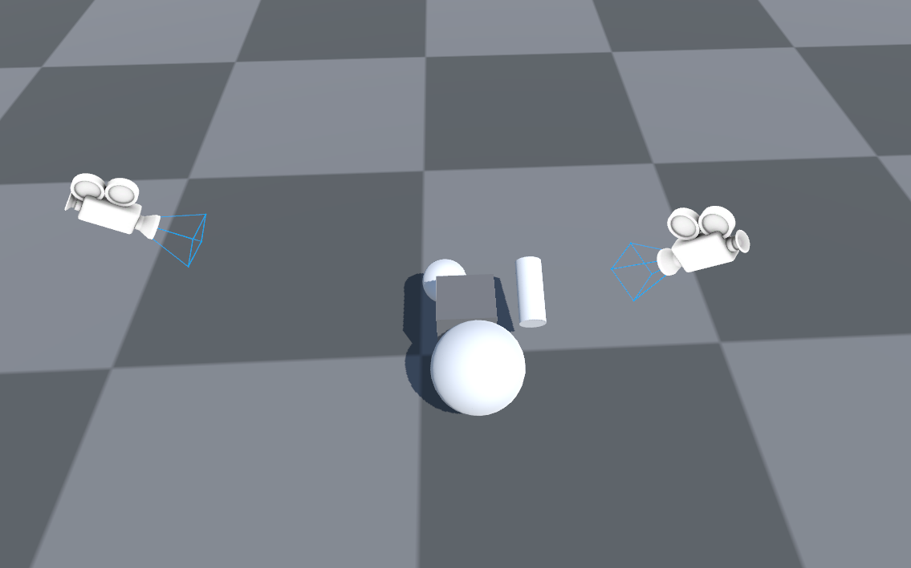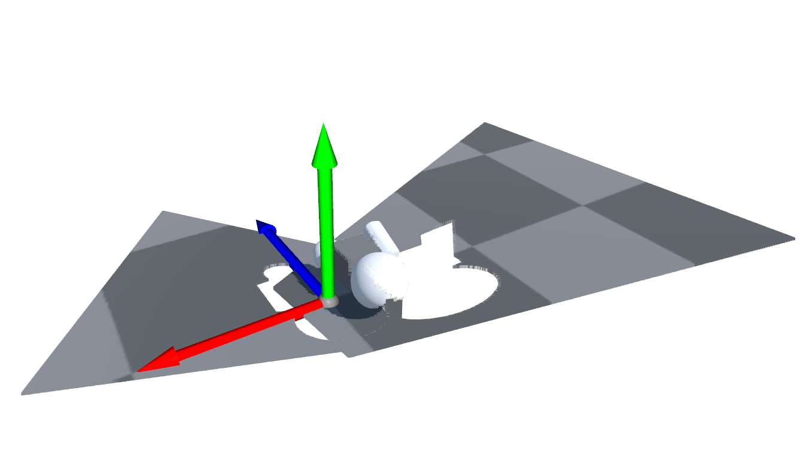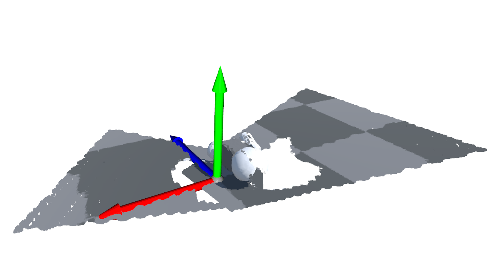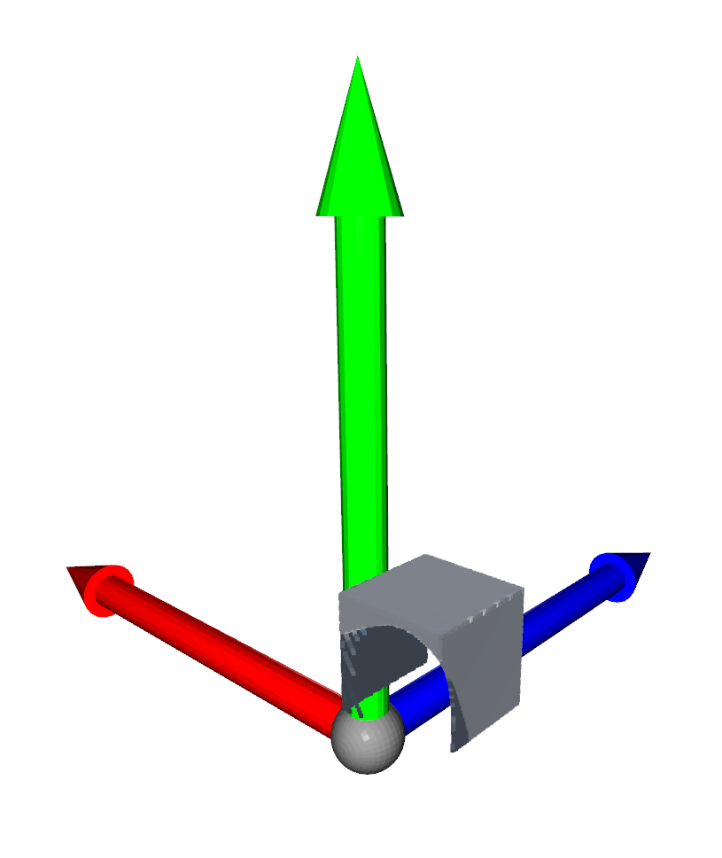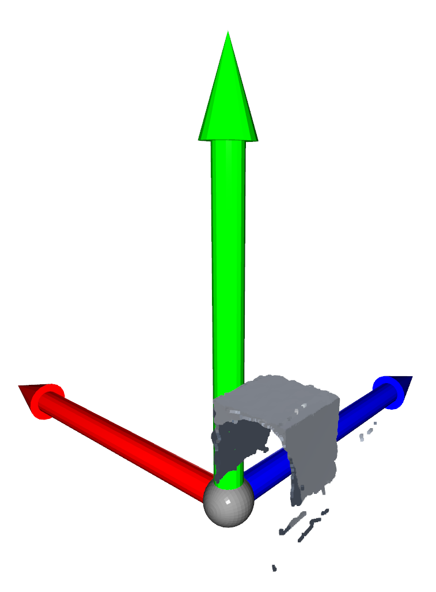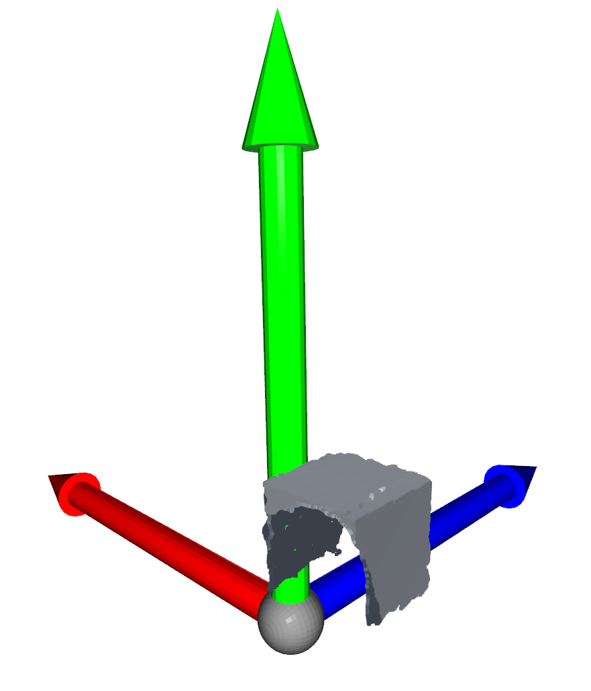 |
| [test_articulation_ik](https://github.com/mvig-robotflow/pyrfuniverse/blob/main/Test/test_articulation_ik.py)                                     | 原生IK                                                                                                     | 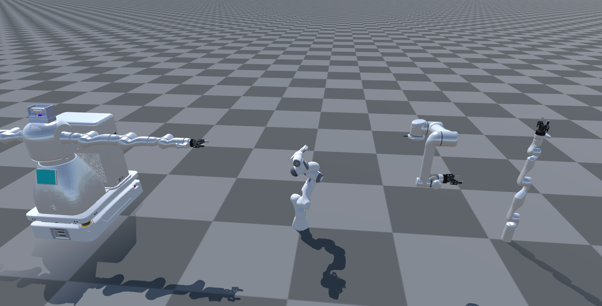                                                                                                                                                                                                                                                                                                                                                                                                                                                                                                                                                                                                                       |
| [test_camera_image](https://github.com/mvig-robotflow/pyrfuniverse/blob/main/Test/test_camera_image.py)                                           | [相机截图示例](./Docs/tutorial%20test_camera_image.md)    |                                                                                                                                                                                                                                                                                                                                                                                                                                                                                                                                                                                                                                                                                                                                 |
| [test_custom_message](https://github.com/mvig-robotflow/pyrfuniverse/blob/main/Test/test_custom_message.py)                                       | 自定义消息和动态消息                                                                                               |                                                                                                                                                                                                                                                                                                                                                                                                                                                                                                                                                                                                                                                                                                                                 |
| [test_debug](https://github.com/mvig-robotflow/pyrfuniverse/blob/main/Test/test_debug.py)                                                         | 各debug模块循环展示                                                                                             | 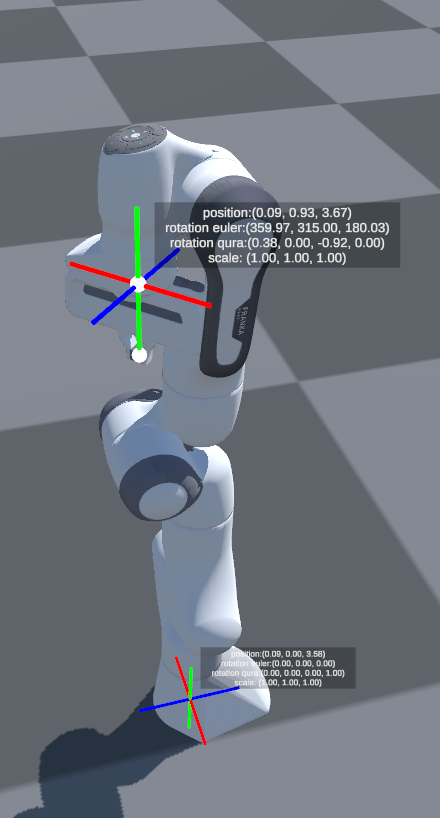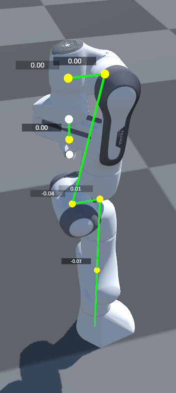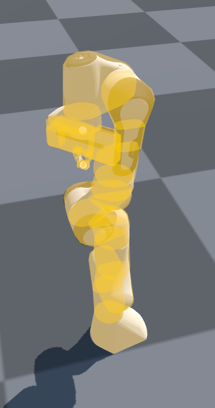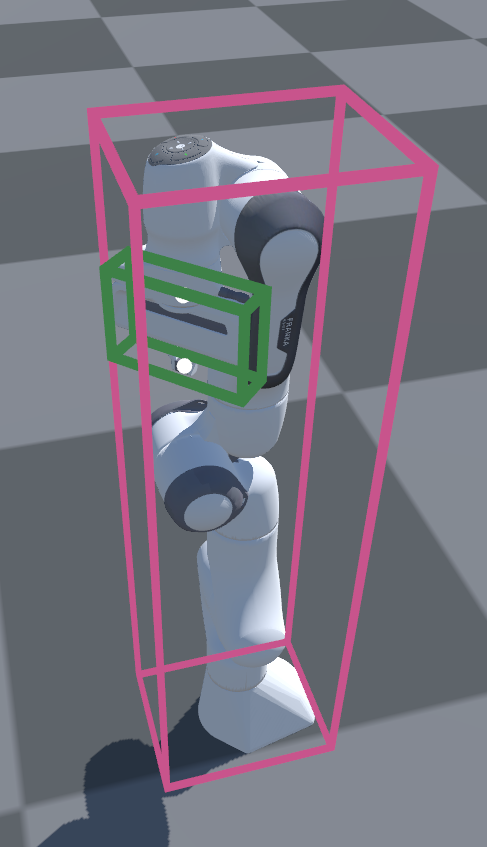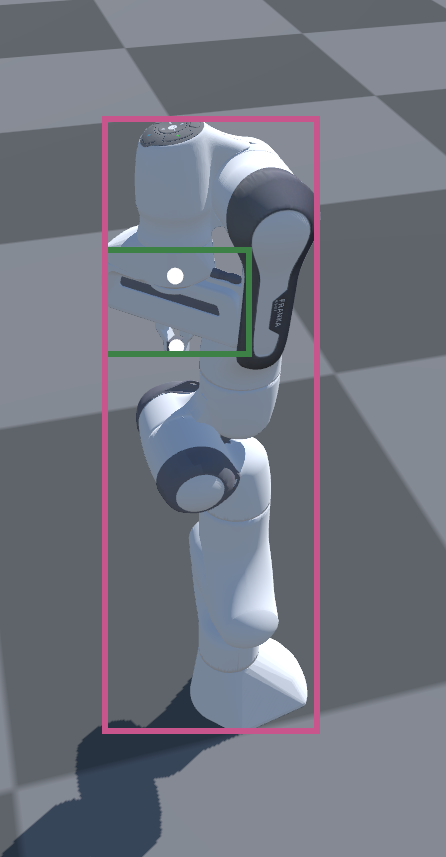                                                                                                                                                                            |
| [test_digit](https://github.com/mvig-robotflow/pyrfuniverse/blob/main/Test/test_digit.py)                                                         | 交互式Digit传感器仿真                                                                                            | 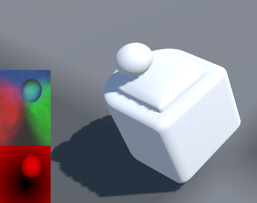                                                                                                                                                                                                                                                                                                                                                                                                                                                                                                                                                                                                                                 |
| [test_grasp_pose](https://github.com/mvig-robotflow/pyrfuniverse/blob/main/Test/test_grasp_pose.py)                                               | Franka抓点预览                                                                                               |                                                                                                                                                                                                                                                                                                                                                                                                                                                                                                                                                                                                                                                                                                                                 |
| [test_grasp_sim](https://github.com/mvig-robotflow/pyrfuniverse/blob/main/Test/test_grasp_sim.py)                                                 | Franka抓取测试                                                                                               | 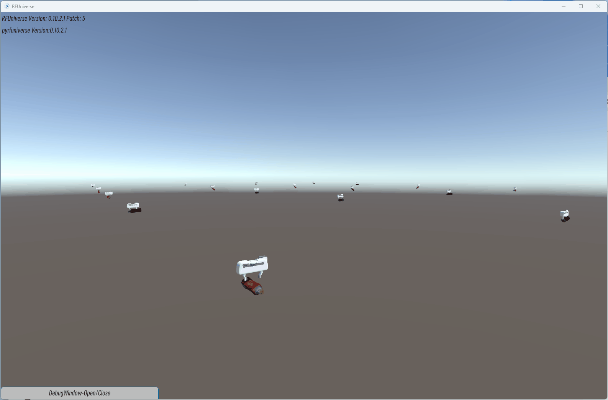                                                                                                                                                                                                                                                                                                                                                                                                                                                                                                                                                                                                                             |
| [test_heat_map](https://github.com/mvig-robotflow/pyrfuniverse/blob/main/Test/test_heat_map.py)                                                   | 交互式heatmap热力图                                                                                            |                                                                                                                                                                                                                                                                                                                                                                                                                                                                                                                                                                                                                                                                                                                                 |
| [test_humanbody_ik](https://github.com/mvig-robotflow/pyrfuniverse/blob/main/Test/test_humanbody_ik.py)                                           | 人体IK接口                                                                                                   |                                                                                                                                                                                                                                                                                                                                                                                                                                                                                                                                                                                                                                                                                                                                 |
| [test_label](https://github.com/mvig-robotflow/pyrfuniverse/blob/main/Test/test_label.py)                                                         | 场景标注2DBBOX                                                                                               |                                                                                                                                                                                                                                                                                                                                                                                                                                                                                                                                                                                                                                                                                                                                 |
| [test_ligth](https://github.com/mvig-robotflow/pyrfuniverse/blob/main/Test/test_light.py)                                                         | 灯光参数设置                                                                                                   |                                                                                                                                                                                                                                                                                                                                                                                                                                                                                                                                                                                                                                                                                                                                 |
| [test_load_mesh](https://github.com/mvig-robotflow/pyrfuniverse/blob/main/Test/test_load_mesh.py)                                                 | [obj模型文件导入为刚体](./Docs/tutorial%20test_load_mesh.md) |                                                                                                                                                                                                                                                                                                                                                                                                                                                                                                                                                                                                                                                                                                                                 |
| [test_load_urdf](https://github.com/mvig-robotflow/pyrfuniverse/blob/main/Test/test_load_urdf.py)                                                 | [urdf文件导入](./Docs/tutorial%20test_load_urdf.md)     |                                                                                                                                                                                                                                                                                                                                                                                                                                                                                                                                                                                                                                                                                                                                 |
| [test_object_data](https://github.com/mvig-robotflow/pyrfuniverse/blob/main/Test/test_object_data.py)                                             | 物体基础数据                                                                                                   |                                                                                                                                                                                                                                                                                                                                                                                                                                                                                                                                                                                                                                                                                                                                 |
| [test_pick_and_place](https://github.com/mvig-robotflow/pyrfuniverse/blob/main/Test/test_pick_and_place.py)                                       | 基础接口和原生IK驱动的抓取                                                                                           |                                                                                                                                                                                                                                                                                                                                                                                                                                                                                                                                                                                                                             |
| [test_point_cloud](https://github.com/mvig-robotflow/pyrfuniverse/blob/main/Test/test_point_cloud.py)                                             | 使用图像宽高和fov获取深度图并转换点云                                                                                     |                                                                                                                                                                                                                                                                                                                                                                                                                                                                                                                                                                                                                                                                                                                                 |
| [test_point_cloud_render](https://github.com/mvig-robotflow/pyrfuniverse/blob/main/Test/test_point_cloud_render.py)                               | .ply点云文件导入并显示                                                                                            |                                                                                                                                                                                                                                                                                                                                                                                                                                                                                                                                                                                                                                                                                                                                 |
| [test_point_cloud_with_intrinsic_matrix](https://github.com/mvig-robotflow/pyrfuniverse/blob/main/Test/test_point_cloud_with_intrinsic_matrix.py) | 使用相机内参获取深度图并转换点云                                                                                         |                                                                                                                                                                                                                                                                                                                                                                                                                                                                                                                                                                                                                                                                                                                                 |
| [test_save_gripper](https://github.com/mvig-robotflow/pyrfuniverse/blob/main/Test/test_save_gripper.py)                                           | 夹爪驱动后保存为obj模型                                                                                            |                                                                                                                                                                                                                                                                                                                                                                                                                                                                                                                                                                                                                                                                                                                                 |
| [test_save_obj](https://github.com/mvig-robotflow/pyrfuniverse/blob/main/Test/test_save_obj.py)                                                   | 场景多个物体保存为obj模型                                                                                           |                                                                                                                                                                                                                                                                                                                                                                                                                                                                                                                                                                                                                                                                                                                                 |
| [test_scene](https://github.com/mvig-robotflow/pyrfuniverse/blob/main/Test/test_scene.py)                                                         | 场景搭建/保存/载入                                                                                               |                                                                                                                                                                                                                                                                                                                                                                                                                                                                                                                                                                                                                                                                                                                                 |
| [test_tobor_move](https://github.com/mvig-robotflow/pyrfuniverse/blob/main/Test/test_tobor_move.py)                                               | tobor车轮驱动移动                                                                                              |                                                                                                                                                                                                                                                                                                                                                                                                                                                                                                                                                                                                                                                                                                                                 |
| [test_urdf_parameter](https://github.com/mvig-robotflow/pyrfuniverse/blob/main/Test/test_urdf_parameter.py)                                       | 关节目标位置设置面板                                                                                               | 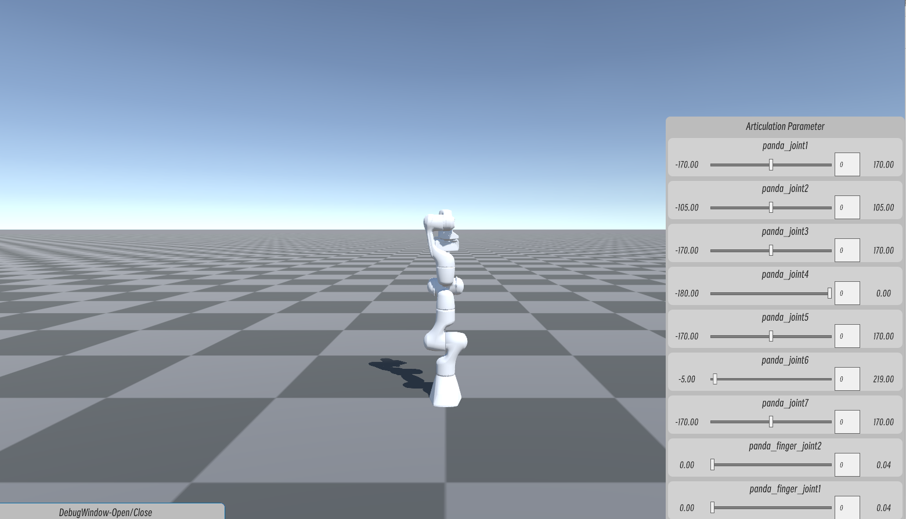                                                                                                                                                                                                                                                                                                                                                                                                                                                                                                                                                                                                                        |
| [test_ompl](https://github.com/mvig-robotflow/pyrfuniverse/blob/main/Test/test_ompl.py)                                                           | 机械臂避障规划<br/>**该示例需要linux并自行安装ompl**                                                                      | 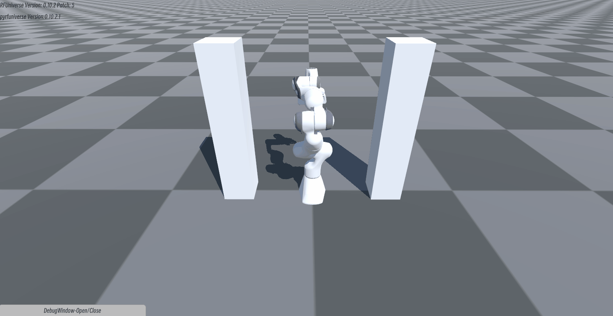                                                                                                                                                                                                                                                                                                                                                                                                                                                                                                                                                                                                                                  |

---

##### 进入Edit模式

启动RFUniverse时添加参数<-edit>可进入Edit模式

Linux:

```
RFUniverse.x86_64 -edit
```

Windows:

```
RFUniverse.exe -edit
```

---

## Unity源工程与SDK使用说明

*以下步骤说明将默认你对UnityEditor有一定了解*

如果你想要在RFUniverse中加入自己的定制资源或功能，可以在RFUniverse开源工程基础上添加

如果你想要为自己的项目添加RFUniverse功能，可以导入[RFUniverse Core SDK](https://github.com/mvig-robotflow/rfuniverse/releases)

**工程中若出现缺失插件的报错，可重启工程后使用菜单RFUniverse/Check Plugins以及RFUniverse/Fix Addressable修复**

---

##### 插件与资源补足

打开RFUniverse工程或导入RFUniverse Core SDK后需要自行补充第三方插件和资源，以开启其中的功能

- [Obi](https://assetstore.unity.com/publishers/5170)：Softbody，Cloth，Fluid等物理仿真插件
- [BioIK](https://assetstore.unity.com/packages/tools/animation/bio-ik-67819)：关节IK解算插件
- YCB数据集和IGibson场景：请从[这里](https://github.com/mvig-robotflow/rfuniverse/releases/tag/Dataset)下载并导入工程

**请将插件放入Plugins目录，导入插件后使用菜单RFUniverse/Check Plugins修复依赖**

---

##### Assets目录结构

* AddressableAssetsData：Unity可寻址资源系统固定目录，管理资源地址和资源打包配置
* Assets：资源目录，包含所有动态加载资源，**如果不需要使用内置的模型和机器人资源，可以将其删除**
  * Model：模型/贴图/材质等资源
  * PhysicalMaterials：物理材质
  * Prefab：预制体，分配Addressable地址用于资源加载
* Extend： 各种扩展Attr模块
* Plugins：扩展插件目录，请将OBI，BioIK等插件放置在此目录下
* RFUniverse：RFUniverse Core 核心功能资源及脚本
* StreamingAssets：配置文件保存目录
  * SceneData：场景JSON文件的保存目录
* TextMesh Pro：TMP UI 资源

---

##### Scene场景

* First：发布程序运行的首个场景，在该场景接收命令行参数后跳转至其他场景（未包含在SDK中）
* Empty：Player模式场景
* Edit：Editor模式场景，在Editmode子模块中

---

##### 工程下运行示例场景

pyrfuniverse/Test目录的功能示例即可以再Release下运行，也可以在UnityEditor中运行

先运行一次Empty场景后退出，随后运行某个python脚本，再在UnityEditor中运行Empty场景即可

---

##### 核心类

###### Attributes

Attr是RFUniverse中物体的基本单元，所有的物体都是基于BaseAttr派生而来，如GameObjectAttr，RigidbodyAttr，ControllerAttr， CmaeraAttr等

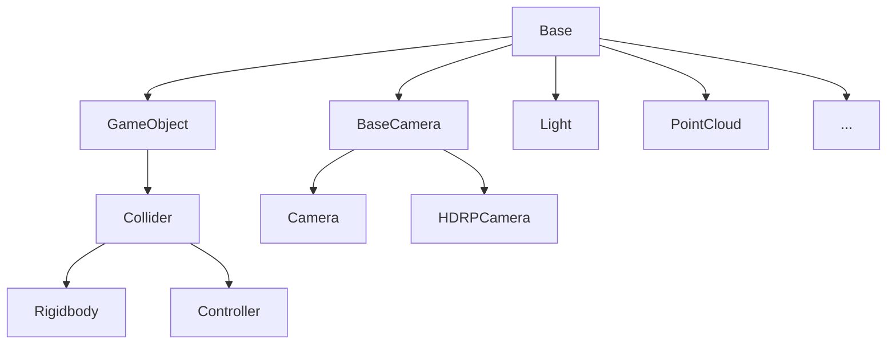

其中：

BaseAttr提供了基础的物体加载创建删除移动等属性

GameObjectAttr扩展物体简单的视觉效果修改

ColldierAttr扩展物体碰撞体的修改功能

RigidbodyAttr扩展物体的刚体属性

ControllerAttr扩展机械臂关节体的操作

CameraAttr相机图像抓取功能

LightAttr灯光控制功能

PointCloudAttr点云导入及渲染功能

---

##### 搭建场景

在RFUniverse中，可以将物体按照规则配置成Prefab并在运行时通过python接口动态加载物体，也可以提前搭建好固定的场景来与python通信，两种方式的选择在于你是否需要在一个发布版中运行不同的环境，大部分情况下在UnityEditor中提前搭建场景更简单快捷。

###### 基本流程：

1. 复制一份Empty场景，在此基础上添加自己的物体。
   
   或者将RFUniverse/Assets/Prefab/RFUniverse导入现有场景，同时移除场景中原本的MainCamera和Directional Light

2. 为需要通信的物体添加BaseAttr脚本，手动设置不同的ID，保证ID没有重复

3. 参照pyrfuniverse/Test编写python脚本，通过ID读取物体上的信息并调用物体上的接口

---

##### 动态消息接口

除了固定参数的接口外，AssetManager还支持发送动态消息进行双向数据通信，更加灵活方便

* **Python->Unity**
  
  C#:
  
  `RFUniverse.PlayerMain.Instance.AddListenerObject(string head, Action<object[]> action);`
  
  传入消息名称和消息接收函数开启监听，接受函数的传入参数类型为 `object[]`
  
  Python:
  
  `env.SendObject(self, head: str, *args)`
  
  传入消息名称和任意数量的数据进行发送

* **Unity->Python**
  
  Python:
  
  `env.AddListenerObject(self, head: str, fun)`
  
  传入消息名称和消息接收函数开启监听，接受函数的传入参数类型为 `list`
  
  C#:
  
  `RFUniverse.PlayerMain.Instance.SendObject(string head, params object[] objects);`
  
  传入消息名称和任意数量的数据进行发送

*请注意，动态消息必须保证接收函数中从 `IncomingMessage`读取数据的类型和顺序与发送消息时传入的类型和顺序相同，否则程序会报错*

动态消息接口的具体使用示例请看[pyrfuniverse/Test/test_custom_message.py](https://github.com/mvig-robotflow/pyrfuniverse/blob/main/Test/test_custom_message.py)

---
