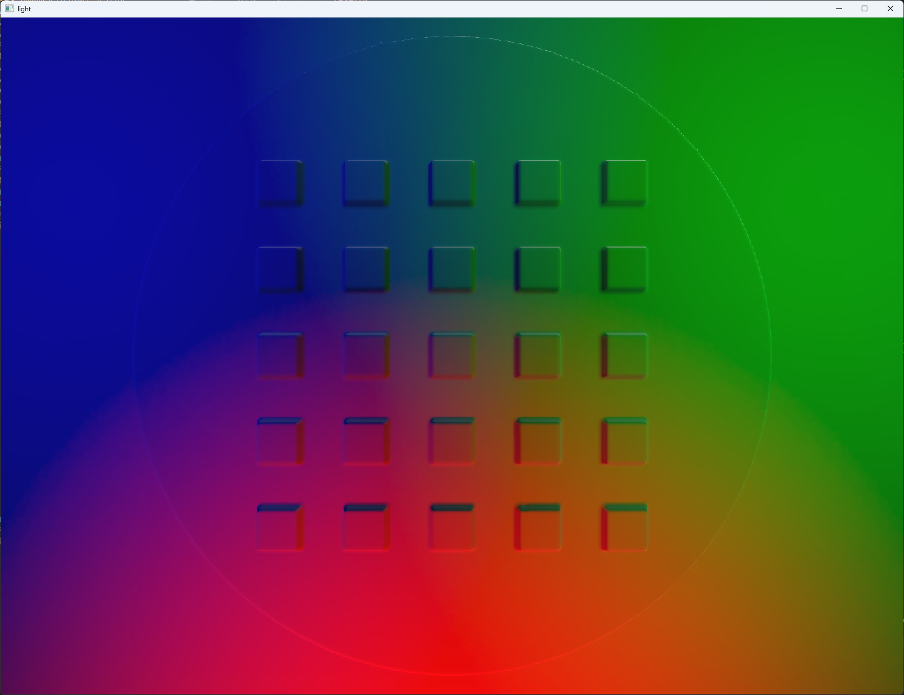
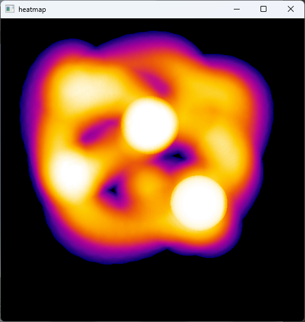

[](https://pypi.org/project/pyrfuniverse/)

[English](./README.md)|中文

[用户文档](https://mvig-robotflow.github.io/pyrfuniverse/)|[开发者指南](./DevDoc_zh.md)

---

RFUniverse是基于Unity开发的用于机器人仿真和强化学习的平台，主要有三个功能模块：

[Python接口](https://mvig-robotflow.github.io/pyrfuniverse/pyrfuniverse.envs.html)：Python封装的通信接口

Unity端Player：接收python端消息并执行仿真

[Unity端Editor](./RFUniverse%20Editor%20User%20Manual.pdf)：用于搭建或编辑仿真场景，此部分代码位于[子模块](https://github.com/mvig-robotflow/rfuniverse_editmode)

---

按照以下步骤配置并通过发布版运行示例场景

1. 下载RFUniverse Release并解压：[RFUniverse Releases](https://github.com/mvig-robotflow/rfuniverse/releases)
   
   解压完成后运行一次程序，进入场景后即可关闭：
   
   Linux：`RFUniverse_For_Linux/RFUniverse.x86_64`
   
   Windows：`RFUniverse_For_Windows/RFUniverse.exe`

2. 创建conda环境并激活，安装与**RFUniverse Release 版本号相同**的pyrfuniverse包：
   
   > :warning:请将以下命令中的[0.12.3]替换为你所下载的RFUniverse Releases的版本号
   
   ```
   conda create -n rfuniverse python=3.10 -y
   conda activate rfuniverse
   pip install pyrfuniverse==0.12.3
   ```

3. Clone pyrfuniverse仓库，切换到与**RFUniverse Release版本号相同的Tag**：
   
   > :warning:请将以下命令中的[0.12.3]替换为你所下载的RFUniverse Releases的版本号
   
   ```
   git clone https://github.com/mvig-robotflow/pyrfuniverse.git
   cd pyrfuniverse
   git checkout v0.12.3
   ```

4. 运行 `pyrfuniverse/Test`下任意python脚本(某些脚本可能需要安装pybullet，open3d等比较大的包)
   
   ```
   cd Test
   python test_pick_and_place.py
   ```

---

Linux系统可能需要进行的额外操作：

如果运行时出现报错请查看该[文档](https://github.com/mvig-robotflow/rfuniverse/issues/3)补充依赖

---

##### Test目录

| 脚本名                                                                                                                                               | 功能介绍                                                | 预览图                                                                                                                                                                                                                                                                                                                                                                                               |
| ------------------------------------------------------------------------------------------------------------------------------------------------- | --------------------------------------------------- | ------------------------------------------------------------------------------------------------------------------------------------------------------------------------------------------------------------------------------------------------------------------------------------------------------------------------------------------------------------------------------------------------- |
| [test_active_depth](https://github.com/mvig-robotflow/pyrfuniverse/blob/main/Test/test_active_depth.py)                                           | [红外深度](./Docs/tutorial%20test_active_depth.py.md)   |  |
| [test_articulation_ik](https://github.com/mvig-robotflow/pyrfuniverse/blob/main/Test/test_articulation_ik.py)                                     | 原生IK                                                |                                                                                                                                                                                                                                                                                                                                               |
| [test_camera_image](https://github.com/mvig-robotflow/pyrfuniverse/blob/main/Test/test_camera_image.py)                                           | [相机截图示例](./Docs/tutorial%20test_camera_image.md)    |                                                                                                                                                                                                                                                                                                                                                                                                   |
| [test_custom_message](https://github.com/mvig-robotflow/pyrfuniverse/blob/main/Test/test_custom_message.py)                                       | 自定义消息和动态消息                                          |                                                                                                                                                                                                                                                                                                                                                                                                   |
| [test_debug](https://github.com/mvig-robotflow/pyrfuniverse/blob/main/Test/test_debug.py)                                                         | 各debug模块循环展示                                        |                                                                                                                        |
| [test_digit](https://github.com/mvig-robotflow/pyrfuniverse/blob/main/Test/test_digit.py)                                                         | 交互式Digit触觉传感器仿真                                     |                                                                                                                                                                                                                                                                                                                                                         |
| [test_gelslim](https://github.com/mvig-robotflow/pyrfuniverse/blob/main/Test/test_gelslim.py)                                                     | GelSlim触觉传感器仿真                                      |                                                                                                                                                                                                                                                                                                                                 |
| [test_grasp_sim](https://github.com/mvig-robotflow/pyrfuniverse/blob/main/Test/test_grasp_sim.py)                                                 | Franka二指夹爪抓取测试                                      |                                                                                                                                                                                                                                                                                                                                                     |
| [test_grasp_pose](https://github.com/mvig-robotflow/pyrfuniverse/blob/main/Test/test_grasp_pose.py)                                               | Franka二指夹爪抓形预览                                      |                                                                                                                                                                                                                                                                                                                                                                                                   |
| [test_heat_map](https://github.com/mvig-robotflow/pyrfuniverse/blob/main/Test/test_heat_map.py)                                                   | 交互式heatmap热力图                                       |                                                                                                                                                                                                                                                                                                                                       |
| [test_humanbody_ik](https://github.com/mvig-robotflow/pyrfuniverse/blob/main/Test/test_humanbody_ik.py)                                           | 人体IK接口                                              |                                                                                                                                                                                                                                                                                                                                                                                                   |
| [test_label](https://github.com/mvig-robotflow/pyrfuniverse/blob/main/Test/test_label.py)                                                         | 场景标注2DBBOX                                          |                                                                                                                                                                                                                                                                                                        |
| [test_ligth](https://github.com/mvig-robotflow/pyrfuniverse/blob/main/Test/test_light.py)                                                         | 灯光参数设置                                              |                                                                                                                                                                                                                                                                                                                                                                                                   |
| [test_load_mesh](https://github.com/mvig-robotflow/pyrfuniverse/blob/main/Test/test_load_mesh.py)                                                 | [obj模型文件导入为刚体](./Docs/tutorial%20test_load_mesh.md) |                                                                                                                                                                                                                                                                                                                                                                                                   |
| [test_load_urdf](https://github.com/mvig-robotflow/pyrfuniverse/blob/main/Test/test_load_urdf.py)                                                 | [urdf文件导入](./Docs/tutorial%20test_load_urdf.md)     |                                                                                                                                                                                                                                                                                                                                                                                                   |
| [test_object_data](https://github.com/mvig-robotflow/pyrfuniverse/blob/main/Test/test_object_data.py)                                             | 物体基础数据                                              |                                                                                                                                                                                                                                                                                                                                                                                                   |
| [test_pick_and_place](https://github.com/mvig-robotflow/pyrfuniverse/blob/main/Test/test_pick_and_place.py)                                       | 基础接口和原生IK驱动的抓取                                      |                                                                                                                                                                                                                                                                                                                                                    |
| [test_point_cloud](https://github.com/mvig-robotflow/pyrfuniverse/blob/main/Test/test_point_cloud.py)                                             | 使用图像宽高和fov获取深度图并转换点云                                |                                                                                                                                                                                                                                                                                                                                                                                                   |
| [test_point_cloud_render](https://github.com/mvig-robotflow/pyrfuniverse/blob/main/Test/test_point_cloud_render.py)                               | .ply点云文件导入并显示                                       |                                                                                                                                                                                                                                                                                                                                                                                                   |
| [test_point_cloud_with_intrinsic_matrix](https://github.com/mvig-robotflow/pyrfuniverse/blob/main/Test/test_point_cloud_with_intrinsic_matrix.py) | 使用相机内参获取深度图并转换点云                                    |                                                                                                                                                                                                                                                                                                                                                                                                   |
| [test_save_gripper](https://github.com/mvig-robotflow/pyrfuniverse/blob/main/Test/test_save_gripper.py)                                           | 夹爪驱动后保存为obj模型                                       |                                                                                                                                                                                                                                                                                                                                                                                                   |
| [test_save_obj](https://github.com/mvig-robotflow/pyrfuniverse/blob/main/Test/test_save_obj.py)                                                   | 场景多个物体保存为obj模型                                      |                                                                                                                                                                                                                                                                                                                                                                                                   |
| [test_scene](https://github.com/mvig-robotflow/pyrfuniverse/blob/main/Test/test_scene.py)                                                         | 场景搭建/保存/载入                                          |                                                                                                                                                                                                                                                                                                                                                                                                   |
| [test_tobor_move](https://github.com/mvig-robotflow/pyrfuniverse/blob/main/Test/test_tobor_move.py)                                               | tobor车轮驱动移动                                         |                                                                                                                                                                                                                                                                                                                                                                                                   |
| [test_urdf_parameter](https://github.com/mvig-robotflow/pyrfuniverse/blob/main/Test/test_urdf_parameter.py)                                       | 关节目标位置设置面板                                          |                                                                                                                                                                                                                                                                                                                                                |
| [test_ompl](https://github.com/mvig-robotflow/pyrfuniverse/blob/main/Test/test_ompl.py)                                                           | 机械臂避障规划<br/>**该示例需要linux并自行安装ompl**                 |                                                                                                                                                                                                                                                                                                                                                          |

---

##### 进入Edit模式

启动RFUniverse时添加参数<-edit>可进入Edit模式

Linux:

```
RFUniverse.x86_64 -edit
```

Windows:

```
RFUniverse.exe -edit
```
