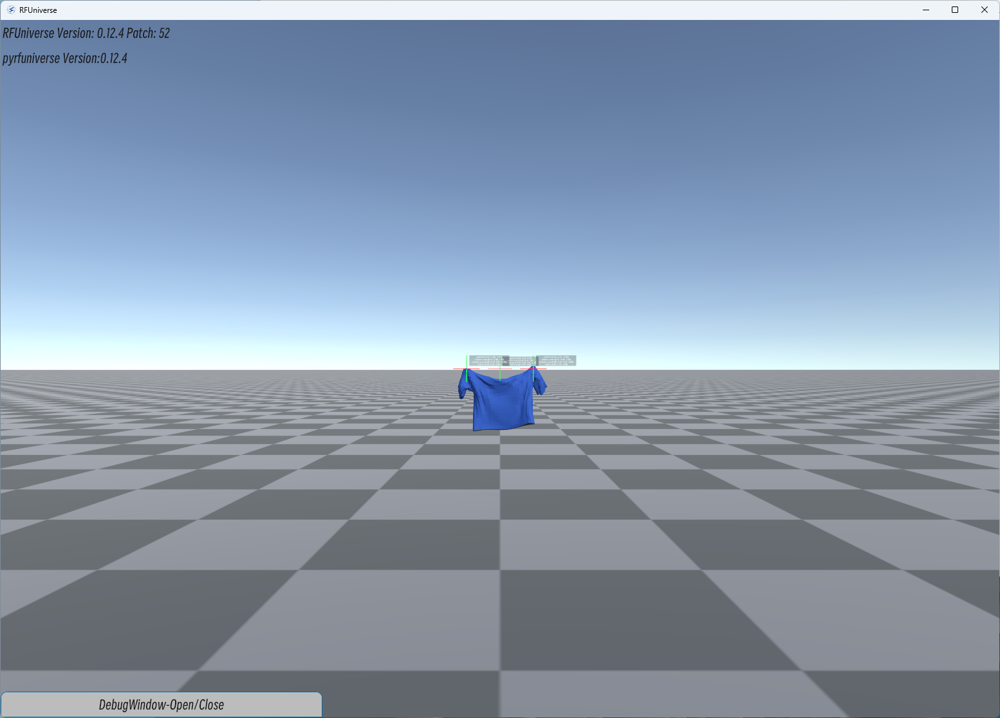

# 

<div align="center">

[](https://pypi.org/project/pyrfuniverse/)
[](https://github.com/robotflow-initiative/rfuniverse/releases)
[](https://github.com/robotflow-initiative/rfuniverse/stargazers)
[](https://github.com/robotflow-initiative/rfuniverse/issues)
[](https://github.com/robotflow-initiative/rfuniverse/pulls)

[English](./README.md) | 中文

[用户文档](https://docs.robotflow.ai/pyrfuniverse/) | [开发者指南](./DevDoc_zh.md)

</div>


---

RFUniverse是基于Unity开发的用于机器人仿真和强化学习的平台，主要有三个功能模块：

[Python接口](https://docs.robotflow.ai/pyrfuniverse/pyrfuniverse.envs.html)：Python封装的通信接口

Unity端Player：接收python端消息并执行仿真

[Unity端Editor](./RFUniverse%20Editor%20User%20Manual.pdf)：用于搭建或编辑仿真场景，此部分代码位于[子模块](https://github.com/mvig-robotflow/rfuniverse_editmode)

---

按照以下步骤配置并通过发布版运行示例场景

1. 新建conda环境安装pyrfuniverse
   
   ```
   conda create -n rfuniverse python=3.10 -y
   conda activate rfuniverse
   pip install pyrfuniverse
   ```

2. 下载RFUniverse仿真环境

   方式一：使用pyrfuniverse命令行入口
   ```
   pyrfuniverse download
   ```
   默认下载最新可用版本到`~/rfuniverse`，可添加可选参数`-s`修改下载路径，`-v`修改下载版本
   
   ---

   方式二：Github Release下载: [RFUniverse Releases](https://github.com/mvig-robotflow/rfuniverse/releases)
   
   下载并解压完成后运行一次程序，进入场景后即可关闭：
   
   Linux：`RFUniverse_For_Linux/RFUniverse.x86_64`
   
   Windows：`RFUniverse_For_Windows/RFUniverse.exe`

3. 安装测试包pyrfuniverse-test，运行示例脚本
   ```
   pip install pyrfuniverse-test
   pyrfuniverse-test test_pick_and_place
   ```
   更多示例可通过`pyrfuniverse-test -h`查看

---

Linux系统可能需要进行的额外操作：

如果运行时出现报错请查看该[文档](https://github.com/mvig-robotflow/rfuniverse/issues/3)补充依赖

---

##### Test目录

| 脚本                                                                                                                                                | 功能                                                                            | 预览                                                                                                                                                                                                                                                                                                                                                                                                                |
| ------------------------------------------------------------------------------------------------------------------------------------------------- | ----------------------------------------------------------------------------- | ----------------------------------------------------------------------------------------------------------------------------------------------------------------------------------------------------------------------------------------------------------------------------------------------------------------------------------------------------------------------------------------------------------------- |
| [test_active_depth](https://github.com/robotflow-initiative/pyrfuniverse/blob/main/test/pyrfuniverse_test/test/test_active_depth.py)                                           | [红外深度](./Docs/tutorial-test_active_depth.md)                                  |  |
| [test_articulation_ik](https://github.com/robotflow-initiative/pyrfuniverse/blob/main/test/pyrfuniverse_test/test/test_articulation_ik.py)                                     | [原生IK](./Docs/tutorial-test_articulation_ik.md)                               |                                                                                                                                                                                                                                                                                                                                                               |
| [test_camera_image](https://github.com/robotflow-initiative/pyrfuniverse/blob/main/test/pyrfuniverse_test/test/test_camera_image.py)                                           | [相机截图示例](./Docs/tutorial-test_camera_image.md)                                |                                                                                                                                                                                                                                                                                                                                                                                                                   |
| [test_custom_message](https://github.com/robotflow-initiative/pyrfuniverse/blob/main/test/pyrfuniverse_test/test/test_custom_message.py)                                       | [自定义消息和动态消息](./Docs/tutorial-test_camera_image.md)                            |                                                                                                                                                                                                                                                                                                                                                                                                                   |
| [test_debug](https://github.com/robotflow-initiative/pyrfuniverse/blob/main/test/pyrfuniverse_test/test/test_debug.py)                                                         | [各debug模块循环展示](./Docs/tutorial-test_debug.md)                                 |                                                                                                                                        |
| [test_digit](https://github.com/robotflow-initiative/pyrfuniverse/blob/main/test/pyrfuniverse_test/test/test_digit.py)                                                         | [交互式Digit触觉传感器仿真](./Docs/tutorial-test_digit.md)                              |                                                                                                                                                                                                                                                                                                                                                                         |
| [test_gelslim](https://github.com/robotflow-initiative/pyrfuniverse/blob/main/test/pyrfuniverse_test/test/test_gelslim.py)                                                     | [GelSlim触觉传感器仿真](./Docs/tutorial-test_gelslim.md)                             |                                                                                                                                                                                                                                                                                                                                                 |
| [test_grasp_sim](https://github.com/robotflow-initiative/pyrfuniverse/blob/main/test/pyrfuniverse_test/test/test_grasp_sim.py)                                                 | [Franka二指夹爪抓取测试](./Docs/tutorial-test_grasp_sim.md)                           |                                                                                                                                                                                                                                                                                                                                                                     |
| [test_grasp_pose](https://github.com/robotflow-initiative/pyrfuniverse/blob/main/test/pyrfuniverse_test/test/test_grasp_pose.py)                                               | [Franka二指夹爪抓形预览](./Docs/tutorial-test_grasp_pose.md)                          |                                                                                                                                                                                                                                                                                                                                                                                                                   |
| [test_heat_map](https://github.com/robotflow-initiative/pyrfuniverse/blob/main/test/pyrfuniverse_test/test/test_heat_map.py)                                                   | [交互式heatmap热力图](./Docs/tutorial-test_heat_map.md)                             |                                                                                                                                                                                                                                                                                                                                                       |
| [test_cloth_attach](https://github.com/robotflow-initiative/pyrfuniverse/blob/main/test/pyrfuniverse_test/test/test_cloth_attach.py)                                           | [布料模拟](./Docs/tutorial-test_cloth_attach.md)                                  |                                                                                                                                                                                                                                                                                                                                     |
| [test_humanbody_ik](https://github.com/robotflow-initiative/pyrfuniverse/blob/main/test/pyrfuniverse_test/test/test_humanbody_ik.py)                                           | [人体IK接口](./Docs/tutorial-test_humanbody_ik.md)                                |                                                                                                                                                                                                                                                                                                                                                                                                                   |
| [test_label](https://github.com/robotflow-initiative/pyrfuniverse/blob/main/test/pyrfuniverse_test/test/test_label.py)                                                         | [场景标注2DBBOX](./Docs/tutorial-test_label.md)                                   |                                                                                                                                                                                                                                                                                                                        |
| [test_ligth](https://github.com/robotflow-initiative/pyrfuniverse/blob/main/test/pyrfuniverse_test/test/test_light.py)                                                         | [灯光参数设置](./Docs/tutorial-test_light.md)                                       |                                                                                                                                                                                                                                                                                                                                                                                                                   |
| [test_load_mesh](https://github.com/robotflow-initiative/pyrfuniverse/blob/main/test/pyrfuniverse_test/test/test_load_mesh.py)                                                 | [obj模型文件导入为刚体](./Docs/tutorial-test_load_mesh.md)                             |                                                                                                                                                                                                                                                                                                                                                     |
| [test_load_urdf](https://github.com/robotflow-initiative/pyrfuniverse/blob/main/test/pyrfuniverse_test/test/test_load_urdf.py)                                                 | [urdf文件导入](./Docs/tutorial-test_load_urdf.md)                                 |                                                                                                                                                                                                                                                                                                                                                                                                                   |
| [test_object_data](https://github.com/robotflow-initiative/pyrfuniverse/blob/main/test/pyrfuniverse_test/test/test_object_data.py)                                             | [物体基础数据](./Docs/tutorial-test_object_data.md)                                 |                                                                                                                                                                                                                                                                                                                                                                                                                   |
| [test_pick_and_place](https://github.com/robotflow-initiative/pyrfuniverse/blob/main/test/pyrfuniverse_test/test/test_pick_and_place.py)                                       | [基础接口和原生IK驱动的抓取](./Docs/tutorial-test_pick_and_place.md)                      |                                                                                                                                                                                                                                                                                                                                                                    |
| [test_point_cloud](https://github.com/robotflow-initiative/pyrfuniverse/blob/main/test/pyrfuniverse_test/test/test_point_cloud.py)                                             | [使用图像宽高和fov获取深度图并转换点云](./Docs/tutorial-test_point_cloud.md)                   |                                                                                                                                                                                                                                                                                                                                                                                                                   |
| [test_point_cloud_render](https://github.com/robotflow-initiative/pyrfuniverse/blob/main/test/pyrfuniverse_test/test/test_point_cloud_render.py)                               | [.ply点云文件导入并显示](./Docs/tutorial-test_ply_render.md)                           |                                                                                                                                                                                                                                                                                                                                                                                                                   |
| [test_point_cloud_with_intrinsic_matrix](https://github.com/robotflow-initiative/pyrfuniverse/blob/main/test/pyrfuniverse_test/test/test_point_cloud_with_intrinsic_matrix.py) | [使用相机内参获取深度图并转换点云](./Docs/tutorial-test_point_cloud_with_intrinsic_matrix.md) |                                                                                                                                                                                                                                                                                                                                                                                                                   |
| [test_save_gripper](https://github.com/robotflow-initiative/pyrfuniverse/blob/main/test/pyrfuniverse_test/test/test_save_gripper.py)                                           | [夹爪驱动后保存为obj模型](./Docs/tutorial-test_save_gripper.md)                         |                                                                                                                                                                                                                                                                                                                                                                                                                   |
| [test_save_obj](https://github.com/robotflow-initiative/pyrfuniverse/blob/main/test/pyrfuniverse_test/test/test_save_obj.py)                                                   | [场景多个物体保存为obj模型](./Docs/tutorial-test_save_obj.md)                            |                                                                                                                                                                                                                                                                                                                                                                                                                   |
| [test_scene](https://github.com/robotflow-initiative/pyrfuniverse/blob/main/test/pyrfuniverse_test/test/test_scene.py)                                                         | [场景搭建/保存/载入](./Docs/tutorial-test_scene.md)                                   |                                                                                                                                                                                                                                                                                                                                                                                                                   |
| [test_tobor_move](https://github.com/robotflow-initiative/pyrfuniverse/blob/main/test/pyrfuniverse_test/test/test_tobor_move.py)                                               | [tobor车轮驱动移动](./Docs/tutorial-test_tobor_move.md)                             |                                                                                                                                                                                                                                                                                                                                                                                                                   |
| [test_urdf_parameter](https://github.com/robotflow-initiative/pyrfuniverse/blob/main/test/pyrfuniverse_test/test/test_urdf_parameter.py)                                       | [关节目标位置设置面板](./Docs/tutorial-test_urdf_parameter.md)                          |                                                                                                                                                                                                                                                                                                                                                                |
| [test_ompl](https://github.com/robotflow-initiative/pyrfuniverse/blob/main/test/pyrfuniverse_test/test/test_ompl.py)                                                           | 机械臂避障规划<br/>**该示例需要linux并自行安装ompl**                                           |                                                                                                                                                                                                                                                                                                                                                                          |


---

##### 进入Edit模式

启动RFUniverse时添加参数<-edit>可进入Edit模式

Linux:

```
RFUniverse.x86_64 -edit
```

Windows:

```
RFUniverse.exe -edit
```

---

##### 常见问题Q&A

[Q&A](./QA.md)
